# Lab 3 – Design Something Small

## Design
For this project, we were assigned to create a 3D printable CAD model and then print it. The main stipulations included that we were to not have any overhangs, so it inspired me to try to learn how to take an image and turn it into a printable model. The first day of this project, I was wearing a shirt from my favorite Manga series called Berserk, so I decided to create something from the series. I knew instantly what to make, since there is a very famous symbol from Berserk that would be timely to make. While searching through google images, I stumbled upon [this decal](https://www.minglewoodtrading.com/berserk-norse-rune-vinyl-decal-v4-viking-berserker-die-cut-sticker/). What I liked about it was that it had nice groves to the edges that I felt gives it more character.

Next, I imported the picture into the picture editing program GIMP. Once there, I simply turned the image into black and white then isolated cut the background around it out. I did this because (as seen in the above picture) they added a strange background and it just made the image too big, and luckily this actually made my job easier later. The problem is that I later found out that leaving the background out caused issues in SolidWorks, so I simply exported it as a jpg which brought a simple one back.
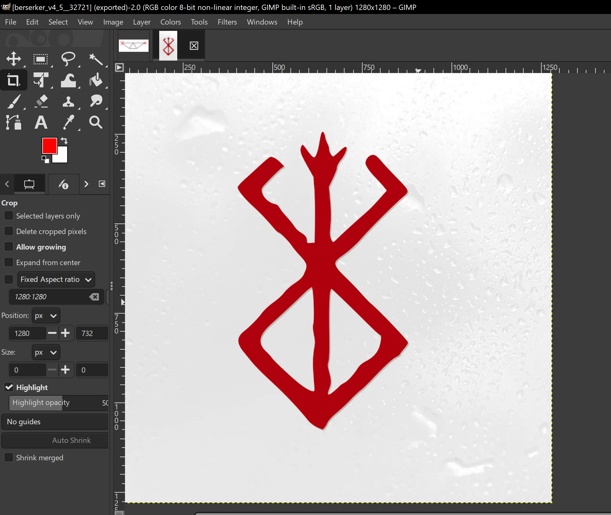 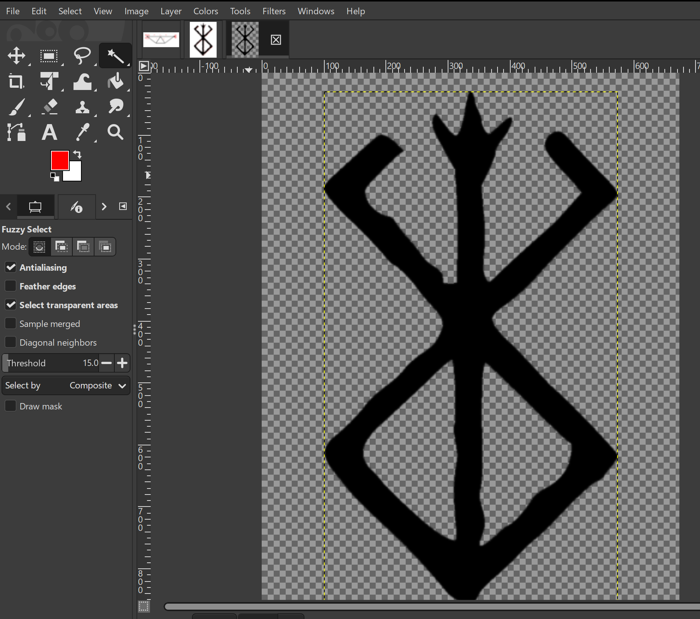

After I initially imported the image into SolidWorks, I realized that it could be a painstaking task to manually outline the image. Therefore, I tried searching online if there was anyway to automate the process, and luckily SolidWorks does have it. It is an add-on called Autotrace, pretty on the nose. For the next couple steps [I followed this website](https://www.goengineer.com/blog/solidworks-autotrace-tool-tutorial) to just get it set up. To start, and after opening SolidWorks, I want to the top of the screen and then went from Tools → Add-Ins. Once it opened the Add-Ins manager. I scrolled down and check marked the box next to Autotrace. Lastly, I restarted SolidWorks.
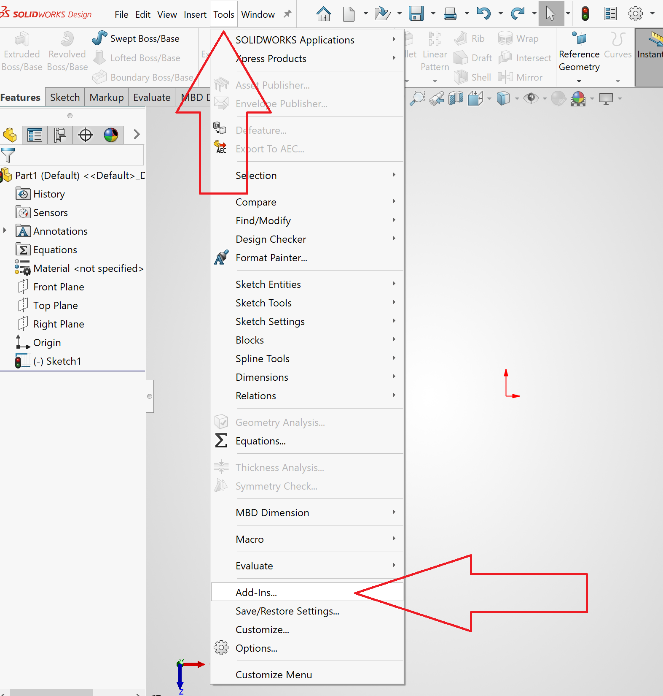 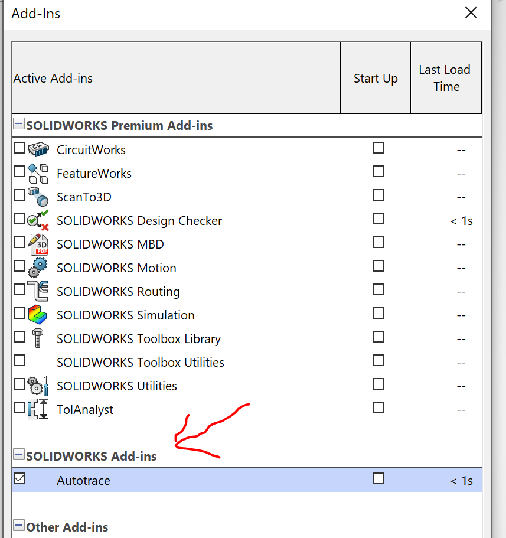

Once SolidWorks booted backup, and created a sketch. Then I went back up to the top of the screen and went from Tools → Sketch Tools → Sketch Picture. This opened up a file manager and I selected the image file I created.
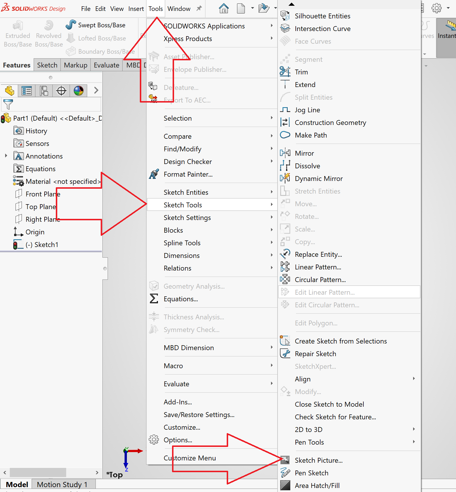

This brought up the image onto the sketch with a submenu. I then clicked the little arrow at the top of it. Now, one thing I missed was that there was a way to adjust the scale of the image in meters and, as this will be shown clearly, that will create a rather interesting output in the slicer. 
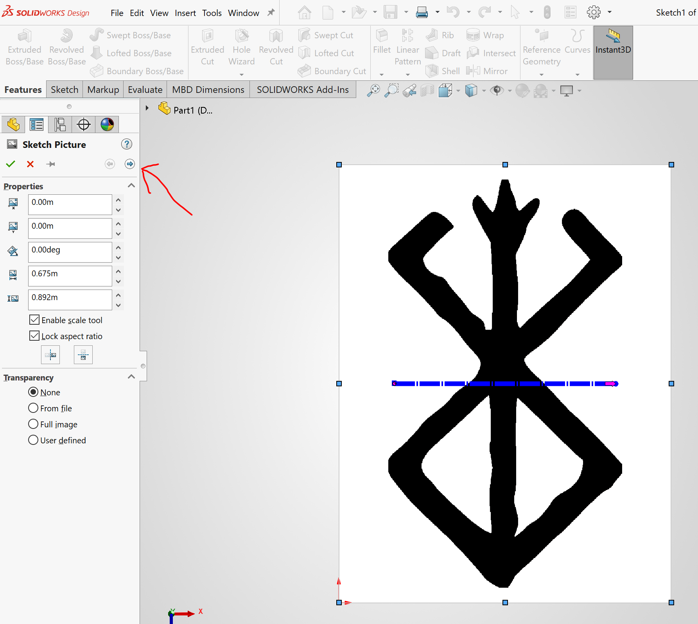

In the new submenu, all I had to do was click the color chooser color, click the black area of the symbol, and hit begin trace to automate the tracing process. The outline are seen in green on the right. What I learned is that it was the right choice to make the entire symbol black, because high contrast makes Autotrace output much better. I messed with the settings a bit, and I found that lowering the bottom two setting made a much better outline.
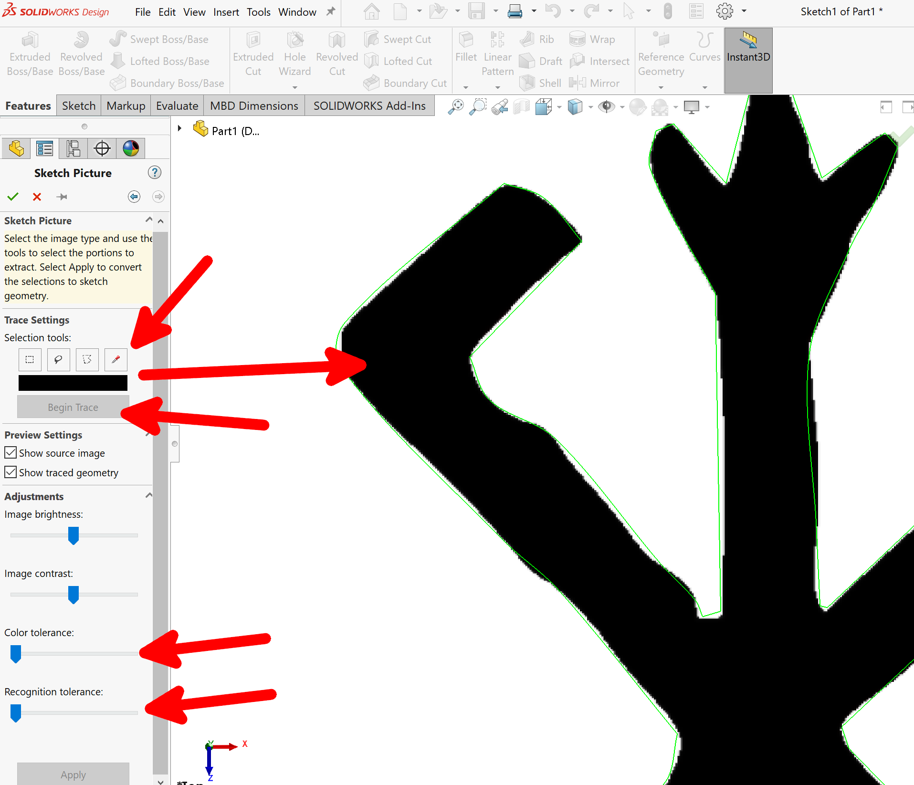
Now the sketch has the outline, so I exited the sketch and went to extrude the surface. To which I realized that outline was way to big. Out of laziness to not want to redo everything, I made a simple ratio of the actual height and thickness that I needed, and the quickly measured height I took of the sketch (the equation I made is seen below). Then I will just scale the result down in the slicer. After I calculated it, I applied it and liked what I saw. So I exported it as an STL.
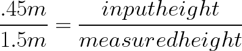
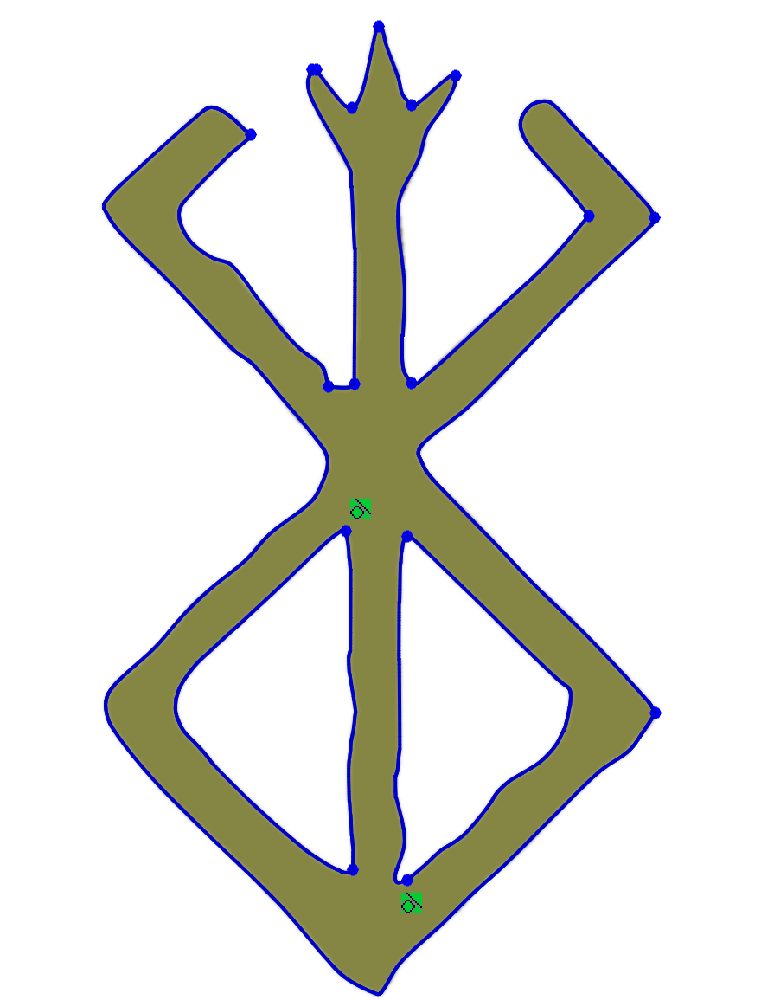
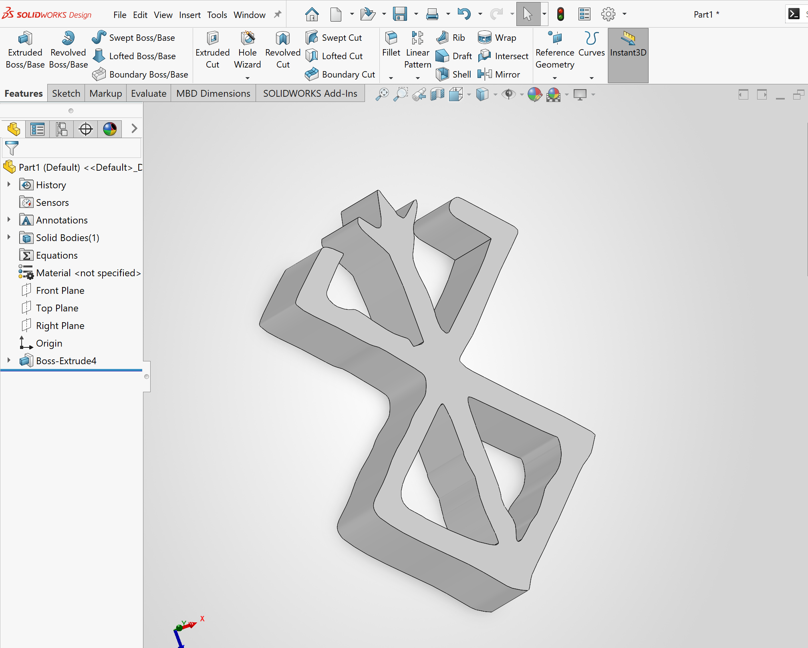

## Research
### Interesting Types of Infills
#### Archimedean chords
While looking at the list of fill patterns in PrusaSlicer. The name of the infill "Archimedean chords" really stuck out to me. I love ancient Greece, so to see the famous "Eureka!" man show up as an infill meant I had to look into it. To my surprise it is actually pretty useful infill. Essentially, it creates the spiral seen below to allow a part to be filled with flowing materials to strengthen the overall part. For example, one could use [resin or even sand to fill in the chords](https://printpal.io/resources/when-to-use-which-infill-pattern-for-3d-printing) to give the part far better structural rigidity. This reduces print times, letting other materials do the rest of the work while freeing up the printer. The infill can also be used by itself for [parts that need flexability](https://help.prusa3d.com/article/infill-patterns_177130).
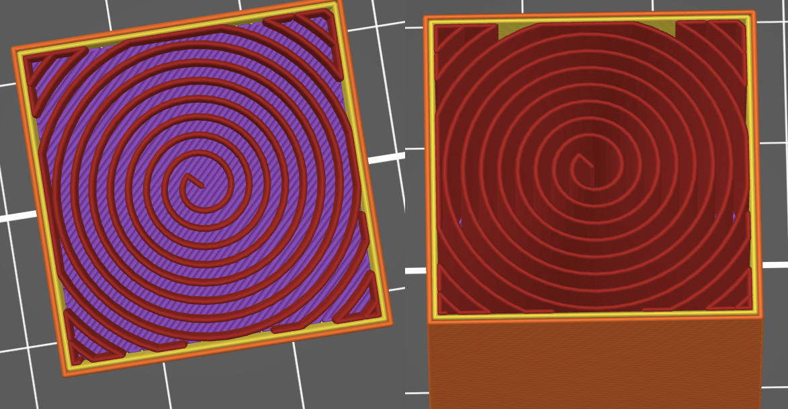

 

#### Lightning

Another name that popped out at me what the lightning info. [After reading about it from the creators of the infill](https://ultimaker.com/learn/how-to-print-like-a-flash-with-lightning-infill/), it is another weirdly useful infill. This seems to be the black sheep of the infills, since it seems to be more of an internal support than just a infill. It works the nearly the same as normal supports, in that it is only created where support is needed inside the model while also increasing in density as the extremity of things like overhang occur (especially the top layer). This mostly only useful for prototypes and printed parts that are just for display, but it greatly decreases the print time and material usage so it is a reasonable choice in such cases. 
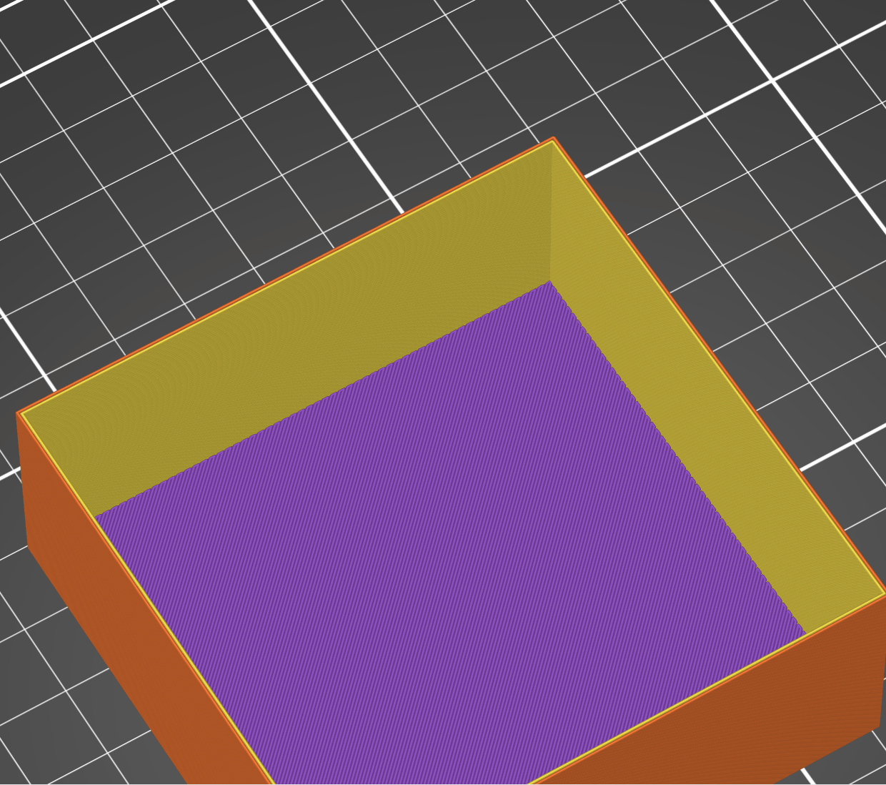

 

#### Adaptive Cubic Infill
The adaptive cubic infill is a dynamic infill that [changes its density depending on where it is inside the print](https://help.prusa3d.com/article/infill-patterns_177130). It uses more infill near the walls, top, and bottom where extra support is needed, while leaving more open space in the center. This is very useful for large 3D prints with a lot of empty space inside. Since there is less material in areas that don't need as much support, so it can allow faster prints and with less filament while still providing good support for the top layers and keeping the strength of other commonly used infills.
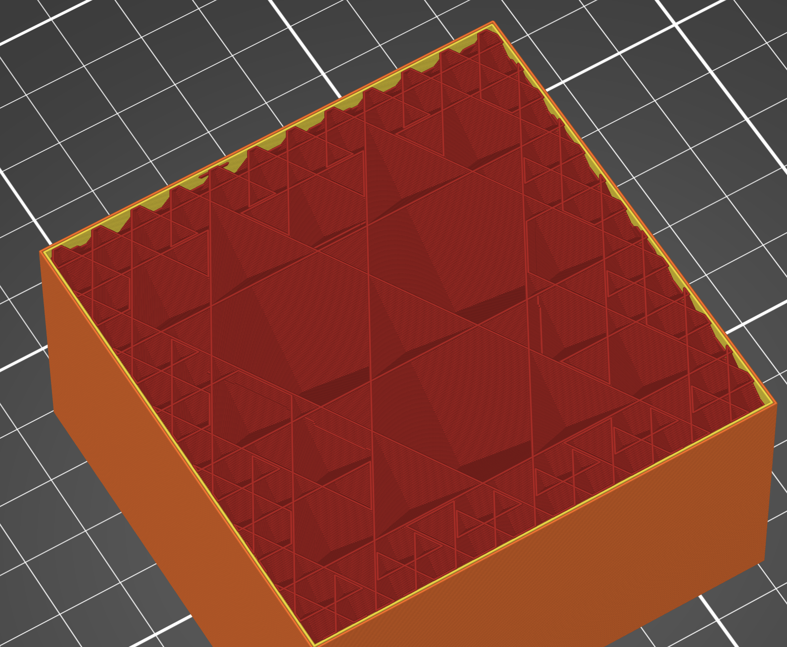

### The Affects of Infills on Material Properties
#### Infill Percentage 
[As this research states](https://link.springer.com/article/10.1186/s44147-023-00273-x), the infill percentage directly affects the primary types of strengths that we use as engineers, such as tensile strength and flexural strength, as well as the stiffness of the material. As density increases, so does strength and stiffness. The article directly makes the points of voids in particular, which I noticed because this is what is being talked about in my Manufacturing Systems class. How impurities affect material properties, and density is in a way a type of impurity.

#### Infill Patterns
[As this research states](https://www.sciencedirect.com/science/article/abs/pii/S2352492818301600), the patterns of an infill directly also directly affect the different kinds of strength and stiffness properties of an object. Each pattern can have special properties that are more useful than other patterns in certain use cases like in how forces are being applied to the object. As in, one pattern might be the best in tensile strength, another might have better stiffness, and others have a balance of good properties. 

## Preprocessor and Printing
### Build Orientation
For the orientation of the print, I chose to lay my model on the flattest side of the part, which so happens to also give the best layer lines. I did so by using the place on face button in Prusa Slicer and selecting one of the flat sides of the model. The general rule of thumb when 3D printing objects is to lay it on its flattest surface. For one, it reduces the amount of supports needed or just makes them flat out unnecessary. Also it gives more surface area connected to the bend which allow better adhesion. [Orientation also affects where layering will occur, so it should also be based on how the loads will be applied to the print job](https://www.aprios.com/insights/optimize-part-orientation-get-the-best-results-from-your-3d-prints). If a compressive force is applied, its better to have the top of stacked layers face the force. If in tension, its better to have the layers go along with the force. Also, visually, top and bottom layers will look better than on the sides, so its best to have the face that will be most looked at as the top in cases like my model.
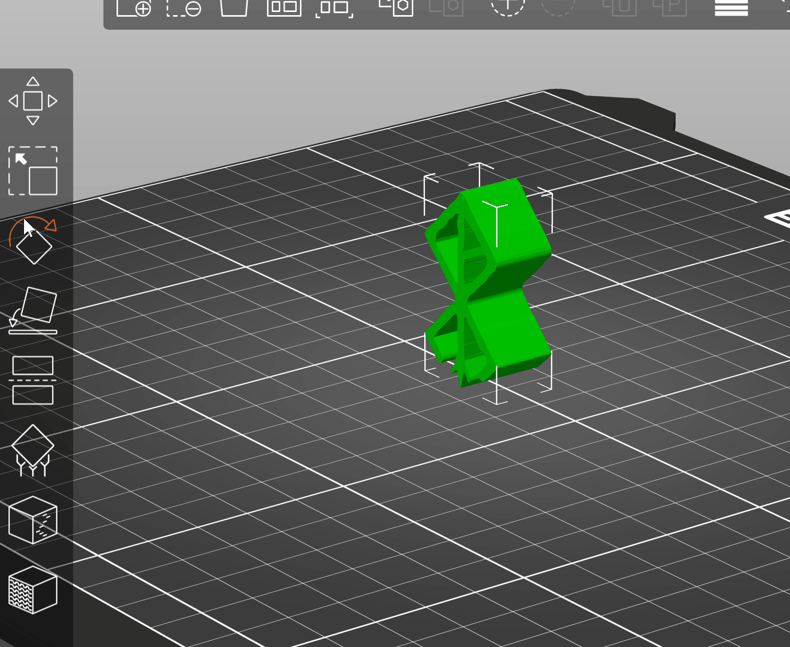

### Scale
After not correctly scaling size of the image in SolidWorks, I ended up having a comically large model in the slicer.
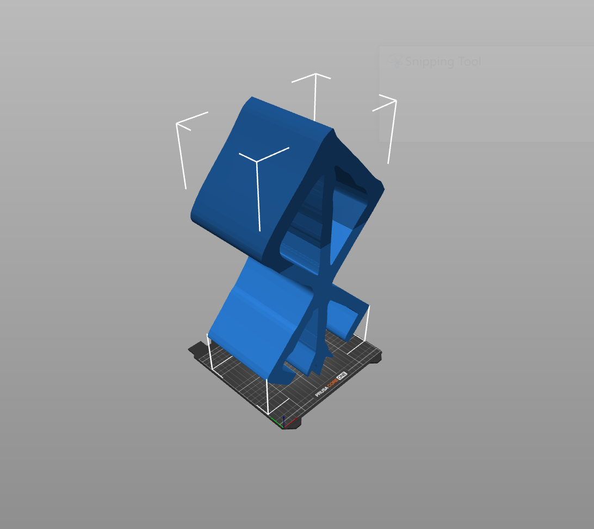
To fix this, I simply divided the desired length of the object I wanted (a little lower than 1.5in to ensure I fit the stipulations) and divided it by the measured length I took in SolidWorks. This gave me about 1/90th of a scale, which is about 1.11%. I set this percentage into the scale section in the slicer. The required dimensions were 1.5 in by 1.5 in by .5 in, and as shown in the screenshot below, I fit within those dimensions.
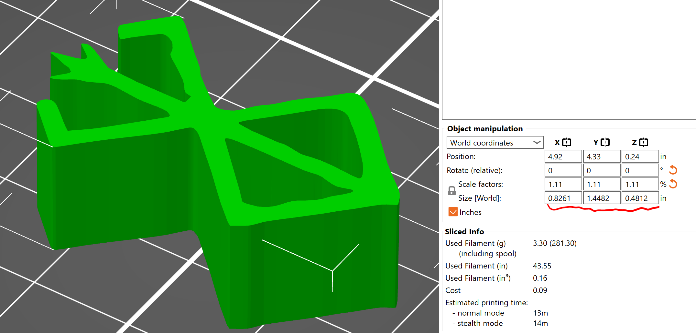

### Infill Choice
I decided to switch to the Gyroid fill pattern because I instantly fell in love with it when it was first showed in class. I love the look of it, how it is generated, and lastly that its actually very strong and useful unlike other interesting looking infill patterns. 
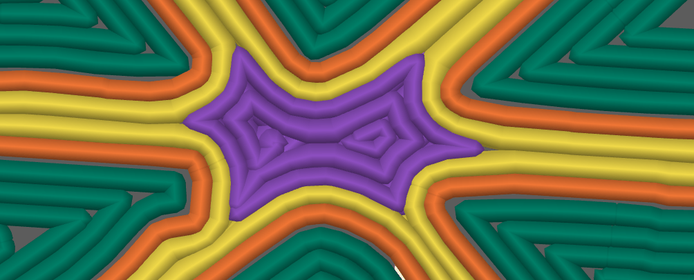

### Wall Thickness Choice
#### Why does it matter?
As the professor taught us in class, wall thickness can positively affect material properties of the object, such as bending and stiffness further than infills can while also making surfaces of the part look better. The cost is that it increases the weight. Also, it might be completely unnecessary to have the extra strength from the increased  walls if it will not be facing serious enough loads. At that point, it may just waste materials, time, and money.
#### My Choice
With permission from the professor, I kept the wall thickness at the default of 2. In one way, this choice already completely fills in the branches of the symbol, so a decrease in the walls could make the part significantly weak in those areas. Also, the center of the symbol barely has any infill support, so an increase might just make the infill useless which leads to problems with answering this assignment. Plus, an increase in wall size is not necessary for such a small part that will only be a display, meaning it won't face any serious loads.
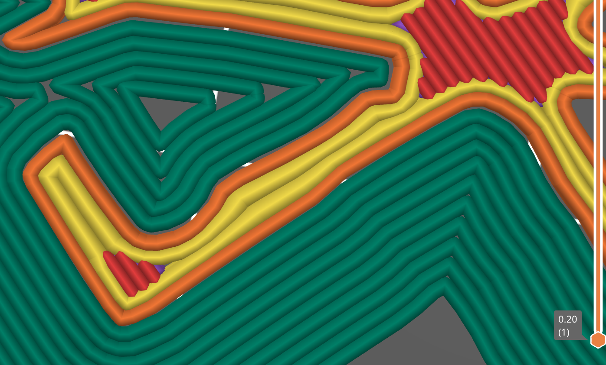

### Additional Choices
Due to how thin each member of the symbol was, I decided that it was necessary to add a brim so that there was less of a chance of a first layer failure. As recommended by my Professor, I kept the number of brims to two. This is because the printed model would be rather small, so only two are necessary to keep the model stuck to the bed. Additionally, I enabled ironing, which smooths out the top layer by moving the hotend right on top of the last layer one the printing is finished. 
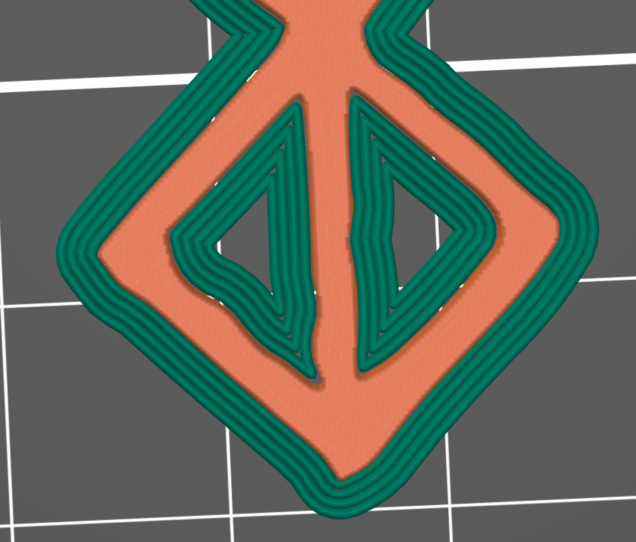

### Failure of First Print Job Attempt
The first printer I used in the Lab was PC_9. Immediately after it started to calibrate, I knew that this printer had issues. It kept failing for several minutes as it tried to level the bed. After the printing began, I went away for a moment, and came back to find that the first layer completely failed. It seems that the printer was clogged from the start, because there was no brim or first layer. Three seconds after I realized what had happened, it then started to spew out PLA. Instead of taking a video to document this, I decided it would be wise to just immediately stop the print. Below is the result of the failure.
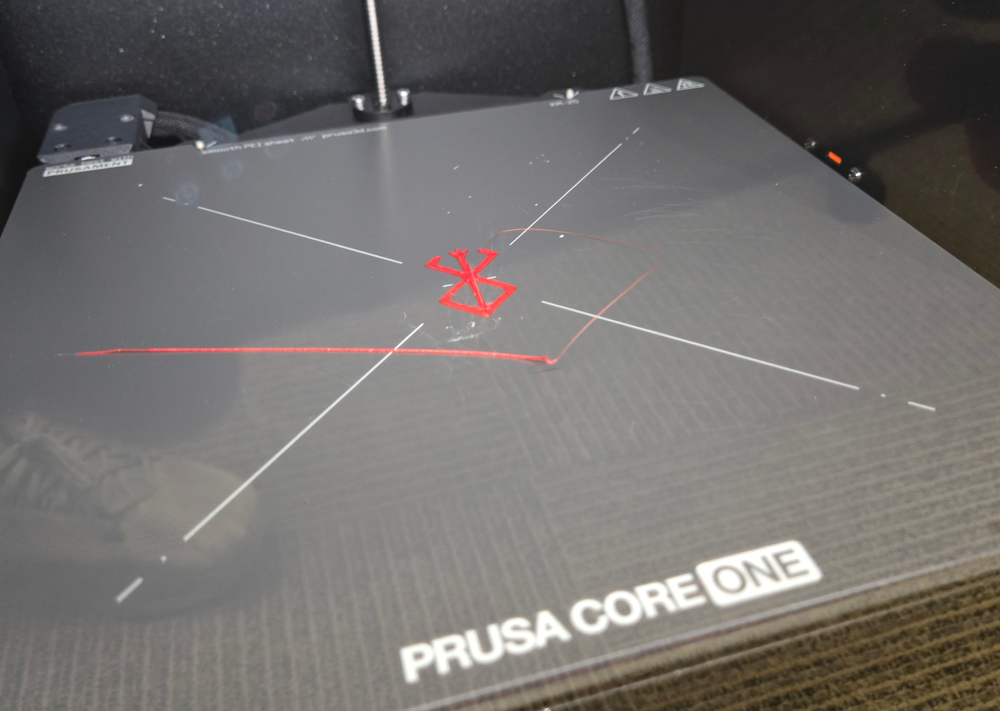

## Print
After switching to printer PC_14 that also used PLA, I had far greater success. Excluding the heat up times, the print job itself only took 13 minutes like the slicer predicted, and I was able to finish the print before the end of class. All I had to do was export the g-code to the printer and finally finish all the setup.
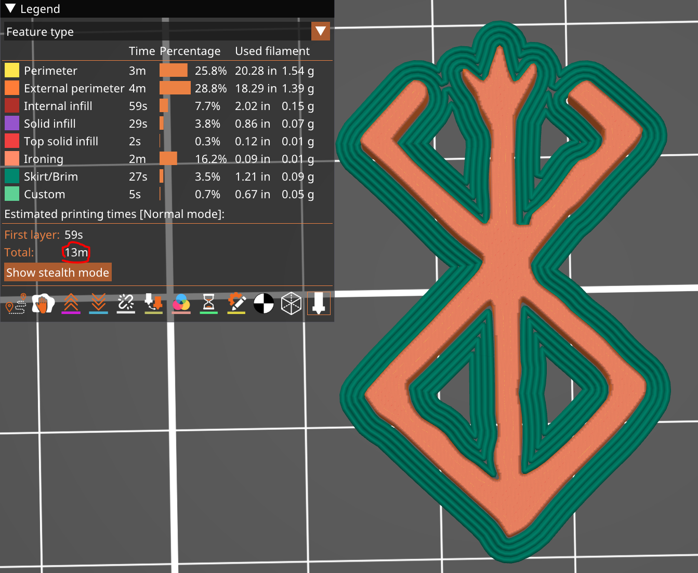
### First Layers
In this first video, the first layer is printing including the brims I added. As shown, the first layers was a massive success in comparison to the first try.
<iframe width="560" height="315" src="https://www.youtube.com/embed/-1zlZicK7hc?si=_Ed02wUueXknyyeq" title="YouTube video player" frameborder="0" allow="accelerometer; autoplay; clipboard-write; encrypted-media; gyroscope; picture-in-picture; web-share" referrerpolicy="strict-origin-when-cross-origin" allowfullscreen></iframe>

### Half-way Through
Next, this is halfway through the print. It seems some of the layers are not very flat and that was concerning me that it might fail again. Luckily, the finished print does not seem to show any major issues.  
<iframe width="560" height="315" src="https://www.youtube.com/embed/GqHuZjuR5sc?si=HYgG4KB26m8znrMU" title="YouTube video player" frameborder="0" allow="accelerometer; autoplay; clipboard-write; encrypted-media; gyroscope; picture-in-picture; web-share" referrerpolicy="strict-origin-when-cross-origin" allowfullscreen></iframe>

### Final Layers
Lastly, this is the final couple layers of the print job along with the ironing. The ironing really helps the final part to look a lot better by making a much smoother top layer.

<iframe width="560" height="315" src="https://www.youtube.com/embed/98cgs2zsbrg?si=jiJZJs3dR2zoL_mi" title="YouTube video player" frameborder="0" allow="accelerometer; autoplay; clipboard-write; encrypted-media; gyroscope; picture-in-picture; web-share" referrerpolicy="strict-origin-when-cross-origin" allowfullscreen></iframe>

### Finished Print
As seen in the below pictures, the model came out very well. The top is smooth and there does not seem to be any major aesthetic problems with the print. However, it seems that the brim setting may need to be modified since they were very hard to take off and seemed to meld too much with the first couple layers. I could put some work into cleaning the bottom of the print with some sand paper, but I do not have the time for that.
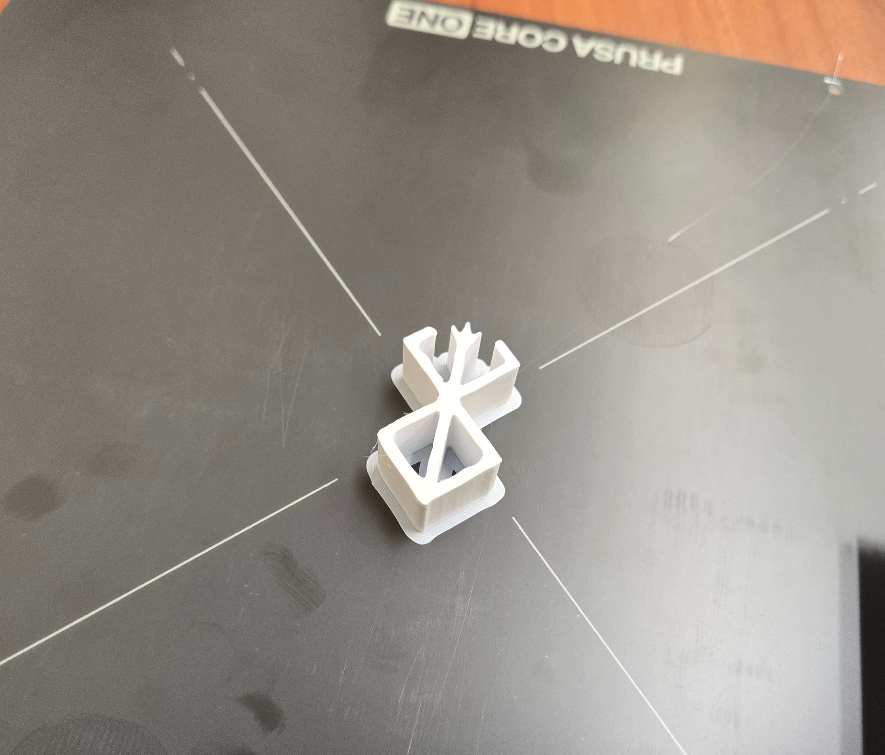
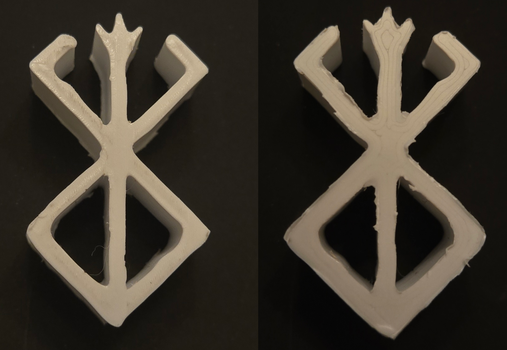

## Lessons Learned
### Personal Lessons
When I used 3D Printers in the past, I really only used them to create displayable objects, so I never really made the connection between them and what I have been learning as an engineering student. It is interesting having my solid mechanics and material science knowledge being applied to this subject. For example, I learned that just how you orientate layers has a direct impact how the object will be able to face tension and compressive forces. Or how I have been seeing the direction relations between what I have learned with structure and infills in this class, with what I have been learning in Manufacturing Systems. Also, it was really cool learning that I can take simple images and directly use them as an outline in a sketch. I will definitely be using this moving forward for entertaining projects and even engineering endeavors.  

### Time
As the weeks go by, it really shows that I am doing more than I should be doing and making school harder than it needs to be. It has taken me 7 hours to complete this.

### Consequences of Poor Structural Decisions  
By creating a structural part that used my chosen infill percentage and and wall thickness, it would almost certainly lead to the yielding and then likely fracturing. 15% infill should only be used for 3D print jobs that will be put on display and not face any sort of stress, the generally rule of thumb that I have learned is that 50% should be the minimum for a functional part. The infill should even be increased further depending on how much forces and stress it will face, possibly even going from [90% to 100% if it is a safety critical part](https://jlc3dp.com/blog/3d-print-infill-structures). This goes for wall thickness as well, 2 walls are not going to cut it for structural parts. The amount of walls needed is dependent on the use case for the object, but generally it should be [5 or more walls](https://createit3d.co.za/blogs/news/how-many-walls-should-a-strong-3d-print-have) for structural parts. Walls are in general better than infills at facing normal and certainly bending stress, so it is possible that a part [should be printed to have 100% walls](https://www.sovol3d.com/blogs/news/wall-thickness-vs-wall-count-3d-printing-differences) depending on the function of the part. In the end, using my settings could lead to a serious accident or even death if they were used for a structural part.

### Known and Unknown Mistakes
As mentioned before, the first time I tried printing my part, it failed to print out the first couple layers because the printer head got clogged. It seemed the clogging fixed itself, but the only way I could truly fix the issue was by canceling the print job and going to another printer. Sometimes, a hothead can get clogged for a fraction of a second, or there could be a movement error in the middle of a print. If something like clogging happens while doing an infill, it is possible that this can snowball into the first and next several infill layers to fail, leading to internal structural errors like voids. Most people do not stare at 3D print jobs that can last for hours and an indiviual can not see the inside of most completely prints without breaking it, so it is entirely possible to easily miss these misprints. So these structural errors are something that has to be taken into account while printing a structural part. One way to combat this is to use certain infill patterns like gyroid, where it has special properties to combat these issues such as [the next line layer could intersect with adjacent infill lines since each line layer is woven into one another](https://bigrep.com/posts/gyroid-infill-3d-printing/) 

### Real Product
One example could be 3D printed prosthetic limb. The different infill patterns, wall thicknesses, and materials must be carefully chosen to control its strength and weight. If the infill is too low or the walls are too thin, the prosthetic could break from general use over time or break instantly after just one fall, potentially causing injury. So it is important to make the right choices so the user doesn't have to keep buying the product over and over or to cause them injury. Also, it is important to keep in mind the cleanliness of the material chosen. The limbs will be used extensively, possible even during exercise, so the material that is chosen should take that into account. 
## Resources
### Websites
1. Site where I got image from - https://www.minglewoodtrading.com/berserk-norse-rune-vinyl-decal-v4-viking-berserker-die-cut-sticker/
2. Tutorial I followed for autotrace - https://www.goengineer.com/blog/solidworks-autotrace-tool-tutorial
3. Additional info about several infills - https://help.prusa3d.com/article/infill-patterns_177130
4. Archamedies infill info - https://printpal.io/resources/when-to-use-which-infill-pattern-for-3d-printing
5. https://ultimaker.com/learn/how-to-print-like-a-flash-with-lightning-infill/
6. https://link.springer.com/article/10.1186/s44147-023-00273-x
7. https://www.sciencedirect.com/science/article/abs/pii/S2352492818301600
8. https://www.aprios.com/insights/optimize-part-orientation-get-the-best-results-from-your-3d-prints
9. https://jlc3dp.com/blog/3d-print-infill-structures
10. https://createit3d.co.za/blogs/news/how-many-walls-should-a-strong-3d-print-have
11. https://www.sovol3d.com/blogs/news/wall-thickness-vs-wall-count-3d-printing-differences
12. https://bigrep.com/posts/gyroid-infill-3d-printing/
 
Additionally I used Youtube to host my videos.

### Physical Resources
Prusa Core One+ - First used machine PC_9 then swapped to PC_14
PLA

### Software Usage
GIMP
SolidWorks
PrusaSlicer
DaVinci Resolve video editor

