# Lab 5 – Design a Snap Fit
## Objective 
For this weeks lab, we are to design and print a a snap fit assembly using two parts that snap together with elastic deformation.
## Modeling
### Snap Fit Design Choice
While there were many interesting design choices to chose from for this snap fit lab. I decided that I would use the simplest design because I was very busy with my other classes. For that reason, I decided on using a pair of straight beam snap fits with a simple rectangular block to connect to.
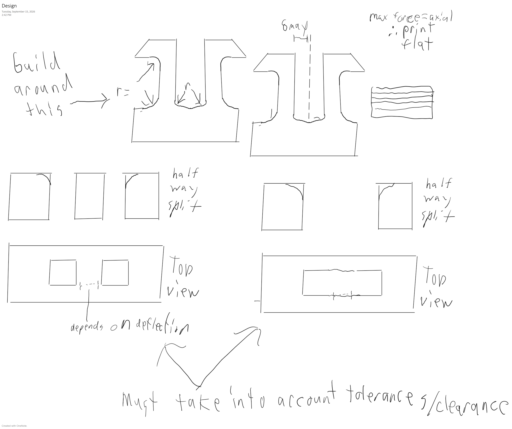
### Choices of Mechanical Properties
Before continuing, I first decided on the type of infill and infill percentage I would used since young's modulus for PLA is heavily dependent on these. My reasons for looking for this combo will be explained at the end of this lab, but I [Found that 50% gyroid infill has an 2.2 ± 0.05 GPa Elastic Modulus from a study](https://link.springer.com/article/10.1007/s00170-020-06138-4/tables/6). I decided to use the highest possible to ensure the Beam will bend, which is about 326335 psi. Then for the yield strength, I decided on [the PLA data sheet given for A4](https://www.matweb.com/search/DataSheet.aspx?MatGUID=ab96a4c0655c4018a8785ac4031b9278&ckck=1),  and I chose its average 6555.706 psi rating for yield strength.

### Solving for Length of the Beam
To simply calculations, I seperated the protrusion from the beam and solved their respective requests independently.
#### Symbolically
Other then having to chose the base and height, I decided that I would also solve for the length by pre-selecting the deflection that I would aim for. Before that, I decided to symbolic solve for the length to simplify calculations. To do so, I took  the equation for a beam with an applied load at the edge of it that was given to us in class, and I simply rearranged it to solve for length
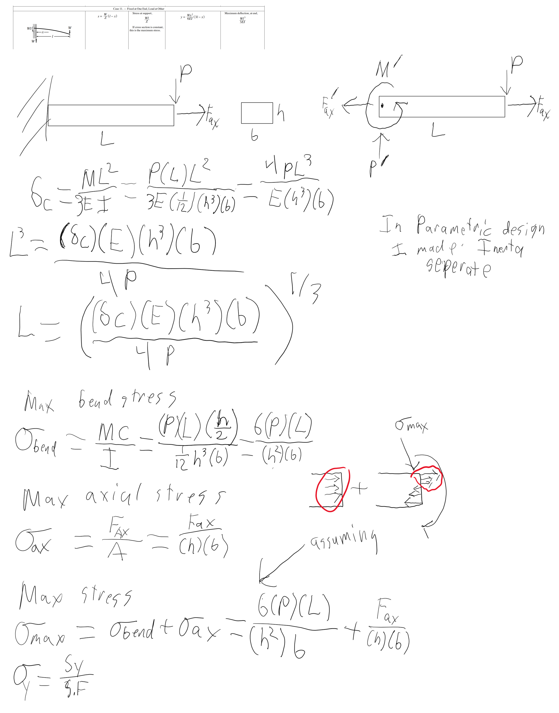

 

#### Choice of Parameters for First Try
Keeping in mind that I would constantly turn millimeters into inches as a personal choice. TO start, I decided on the parameters I would chose. For my first attempt, I decided to try out 7mm height and a 10 mm base because it seemed sturdy and relatively strong. Since the protrusion being small could cause issues when applying forces, I decided to overcompensate by making it 7 mm. Then, I knew that if I were to choice a lower force, it would increase the length (as seen in the equation the two being inversely related) of the beam since I decided on a 7mm protrusion. Therefore, I decided to max the transversal force to lower the length as much as possible. Lastly, I also chose the max axial force as well to make certain that the beam would not break during testing.

#### Solution of First Attempt
After these choices, I plugged them into the equation to see the result. Low and behold the length would be over a foot long!
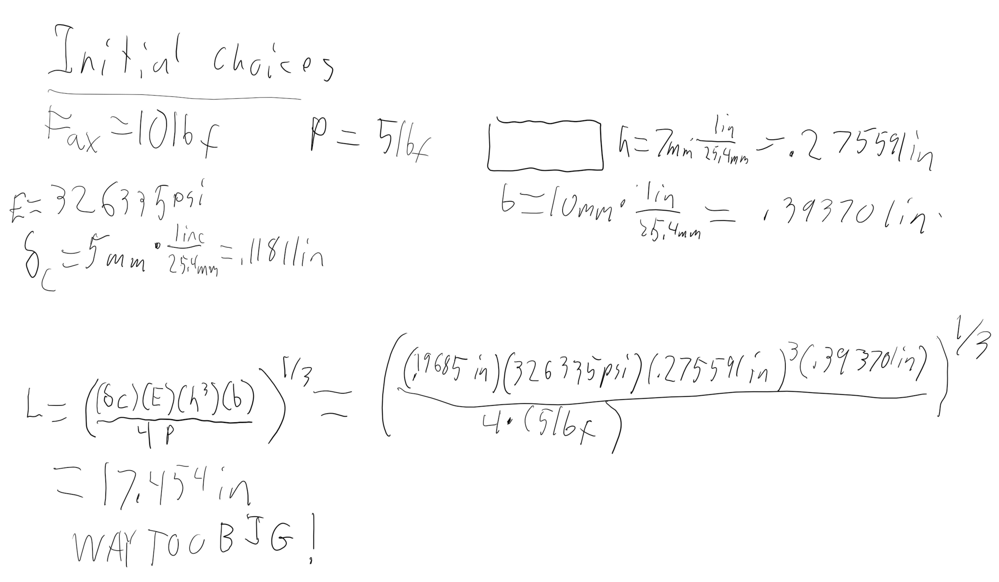

#### Choice of Parameters for Second Try
Clearly the dimensions were not acceptable. To fix this, I decided that I had to take a possible risk and reduce the protrusion. Next I decided that I would change the cross sectional area to be just be a square to make the rest of the project easier. Lastly, I decide to  try out making the base and height just 5mm. These were excellent choices because it drastically reduced the length to about 1.425 in. With that finished, I calculated the axial tension stress, then the stress caused by bending, and apparaently I found that it was within the yield strength divided by the safety factor 

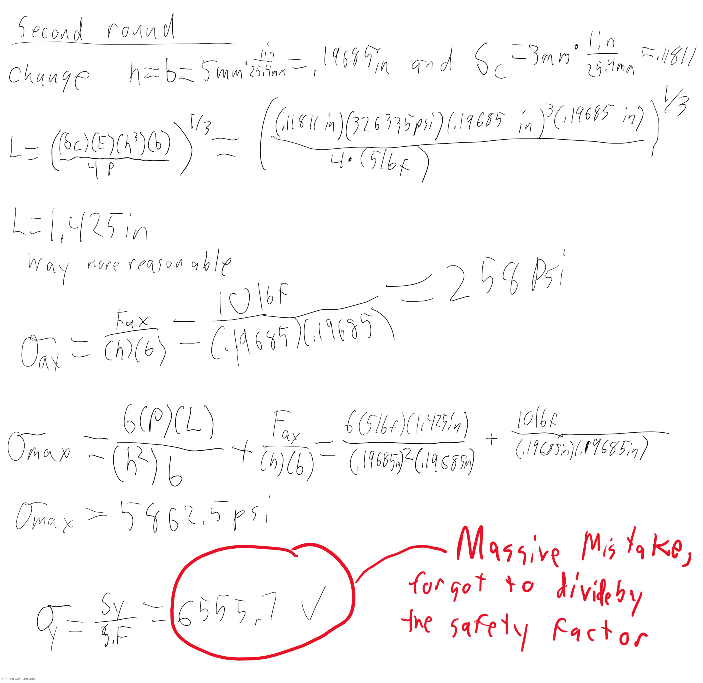

After writing the source for the yield strength down and posting the image of my work. I realized I had made a critical error by forgetting to divide the yield strength by the safety factor. I split the math over two days, so I must have written the yield strength down and didn't write the division by 3.5. The next day I assumed I already had done it. I am used to using MPa for yield and not psi, so I didn't notice the difference. Sadly, the model has already been printed and there is no time to go back and fix this. In real life, a serious mistake like this can cause someone harm.

### Solving for Shear of the Protrusion
### Symbolically
Solving for the shear would be significantly easier, simply I had to decide on a length of the protrusion itself. For simplicity of the math, I treated the protrusion as a cubic shape.  With that in mind, I symbolically for average shear.

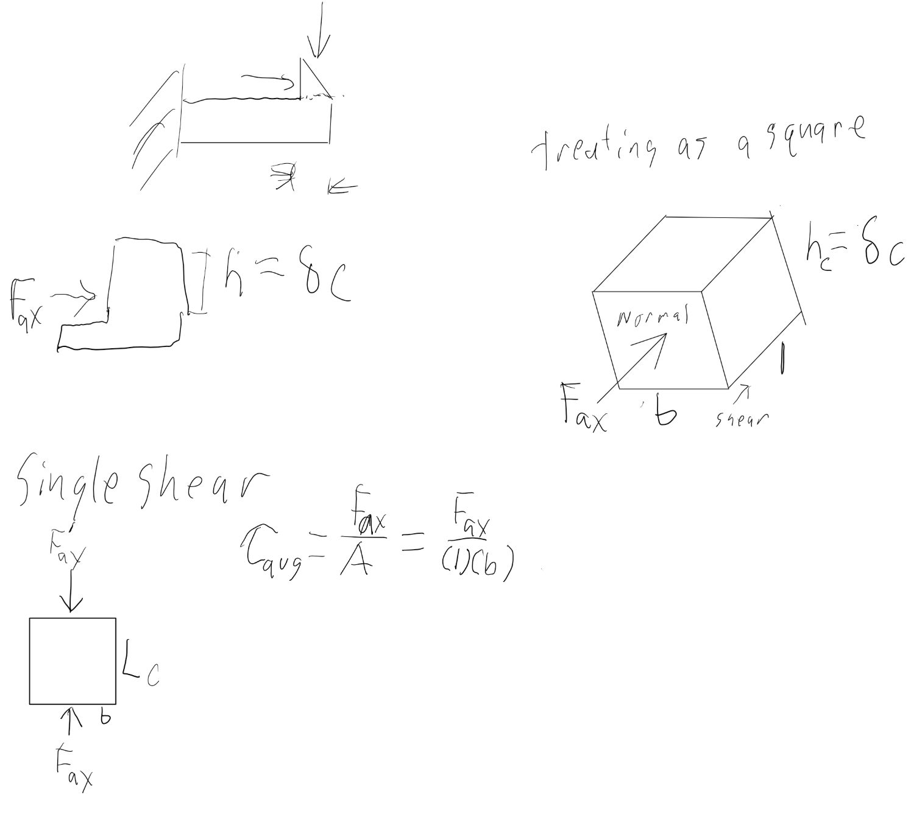

### Solution of the Shear
When I went to calculate the shear, I landed on a 10mm length because I wanted an extra strong backing behind the protrusions since it will likely be more triangle shaped later. 10 lbf is used for the previous calculations, so I wanted to ensure it could take 10 lbf. Also the base is the same as the beam's, so it was also 5mm. Finally I plugged it in an found it would easily be able to handle any possible shear that maybe applied.

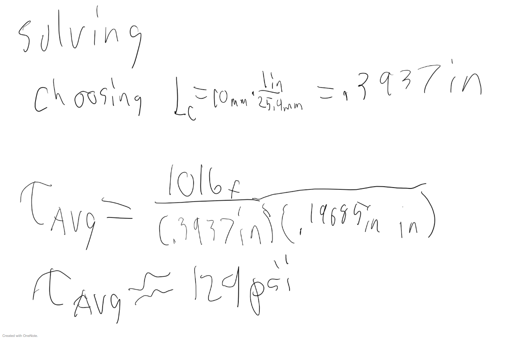

## Parametric Design and CAD
### Parameter Choices for Snap Fit
Instead of just choosing a select few parameters, I decided to add parameters for nearly everything I had used to solve for the length and shear for the beam. This was just incase if I had made any mistakes and so I could just quickly recalculate anything I needed. Ironically, I did not add the bending stress or the yield strength to the because I felt I had gone too far with the parameters I had added. 

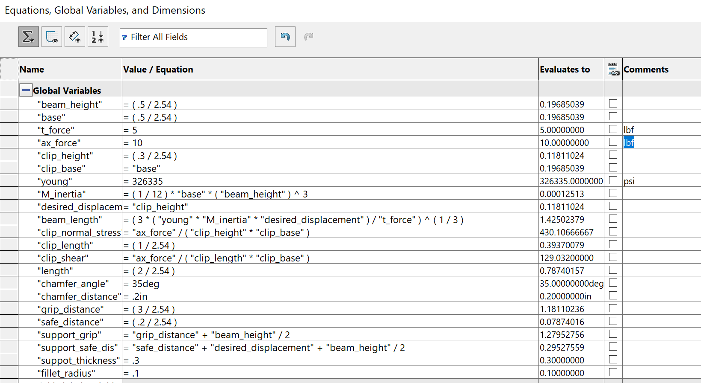

The first new addition I added for the snap fit was a chamfer angle and length. The chamfer will be used to give an angle to the snap fit's protrusion to make it easier for it to slide into the block it will snap into. I decided to make these variable because my goal was to find an angle and length that would protect the sharp edge of the protrusion facing the normal force of the block by having it have about 6.5 mm behind it to make sure that it would not be destroyed. This seemed like a nice way to add a parameter, and it worked out. After adjusting several angles and lengths,  I found that a 35 degree angle and 2mm got me a close result. Instead of adjusting for exactly 3.5mm, I decided to stick with them since they were nice and even numbers. However, I found out after printing that the angle should have been steeper and closer to the tip of the beam.

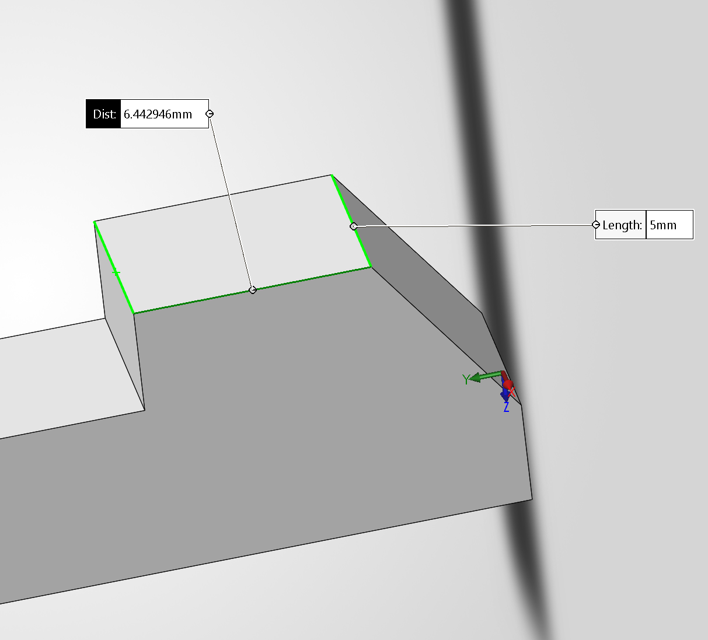

Next, the assignment recommended that we ought to add fillets to inner sharp edges to reduce stress concentration at those locations. Fillets can be rather tricky to work with in SolidWorks when trying to be precise, so instead of having to constantly adjust the fillet, I felt it would be another good parameter to add. My goal was to find a fillet radius that would align perfectly with the protrusions edge touching the block. The parameter ending up helping, however, I later decided that it was not a good idea to put a fillet at the protrusion since it would give a way for it to slip off the block. Also, due to the block's orientation that it would be printed, this meant that the filleted circular edge would not print a smooth surface. In the end, I decided to eyeball the other parts of the model with a fillet to see what looked nice, and I decided on a .1 inch radius.

Lastly, I also decided to turn the piece that connects the two snap ins together into a hand grip to give some leverage when having to test the part. There were several dimensions to take into consideration for this: the gap between the snap ins (including their displacements), the width of two fingers, and the thickness of the beams. To make things simple if I needed to change the gap or finger width if I wanted to change it to fit the professors hand (he wasn't there on Thursday), I turned these into parameters to create two different equations. The length of the side of the gap starting from half the thickness of the snap in to the edge of my finger width for one. The other length would be the addition of the other half thickness, plus the displacement of the snap ins, and then a variable amount of gap to give to ensure the two snap ins will not hit one another. To test, I measured two of my fingers and plugged it in, and then I chose a couple different gap sizes to how it looked. After, the hand grip variable ended up not being useful since the professor wasn't there, I did get some use out of the gap distance. I ended up decided on a 2mm gap since it gave an acceptable looking gap while also making sure there was a good enough distance to ensure they would not hit one another.

### Creating the Snap Fit in CAD
#### Creating the Cantilever Beam
To start, since the two snap fits would be mirrors of one another, only one needed to be focused on. Therefore, I began by making the cross section of the beam. To do so I simply plugged in the parameter values for the height and base of the beam into their respective dimensions.
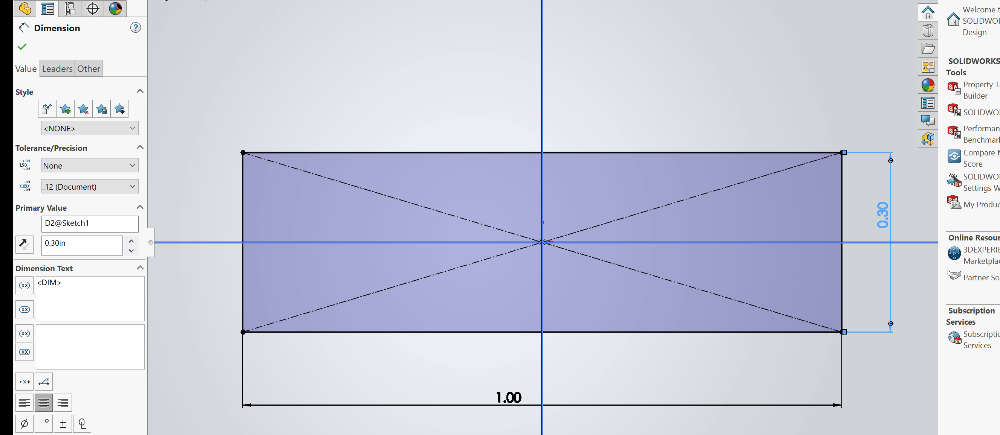

 

After, I extruded the new square to the calculated length of the beam by plugging in the output variable of the deflection equation.
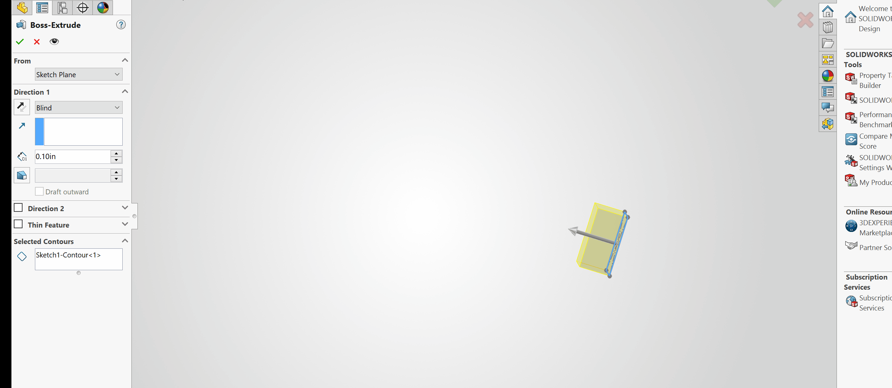
#### Creating the Protrusion
Next, to create the protrusion, I created a square that snapped on the edges of one side of the beam leaving one open to change. I created a dimension for it and plugged in the parameter of the protrusion length I decided on.
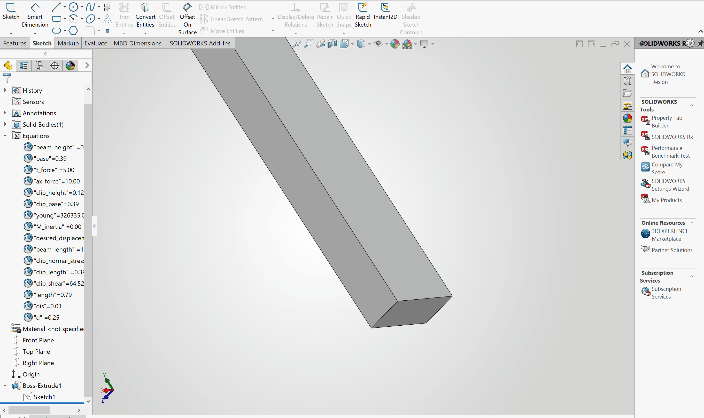

 

Then I extruded it out with the parameter equal to the height of the protrusion (also the deflection value).
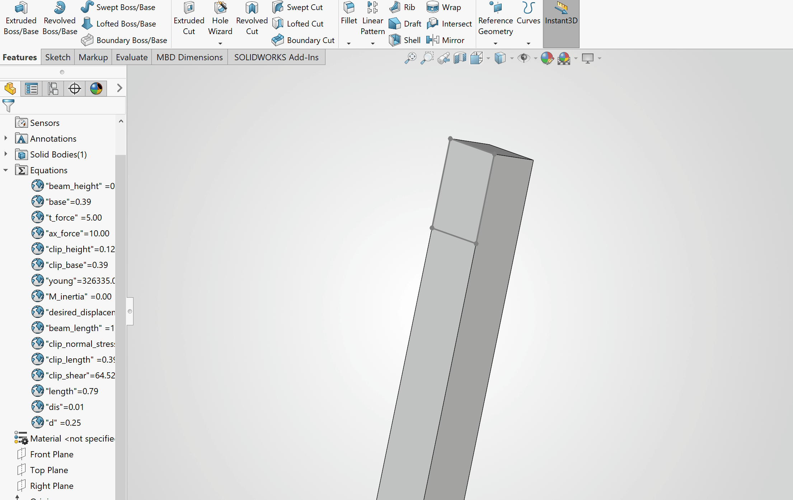

 

Next, I created a chamfer at the outer edge of it and then typed in the variable parameter I had created for the angle and length of the chamfer (the below is a recreation which is why it has the dimesnions I had landed on).

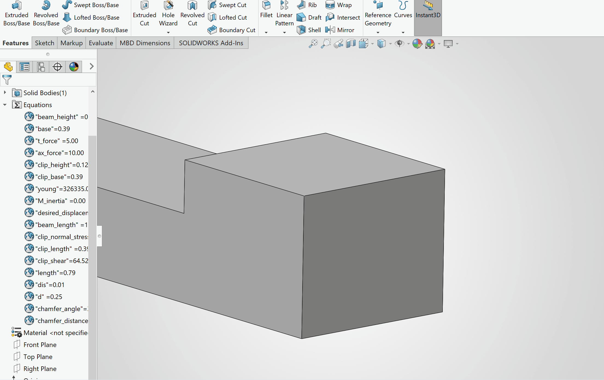

#### Adding the Leverage
To add the finger leverage, I created a sketch on the "wall" side of the beam and created a centerline connecting both centers of the bases. Then I create two squares that aligned with the centerline and the base edges on opposing sides. I did this so that the entire slip fit would lay completely flat on the printing bed. Lastly, I added the the parameter length equations I created to their respective rectangle. 
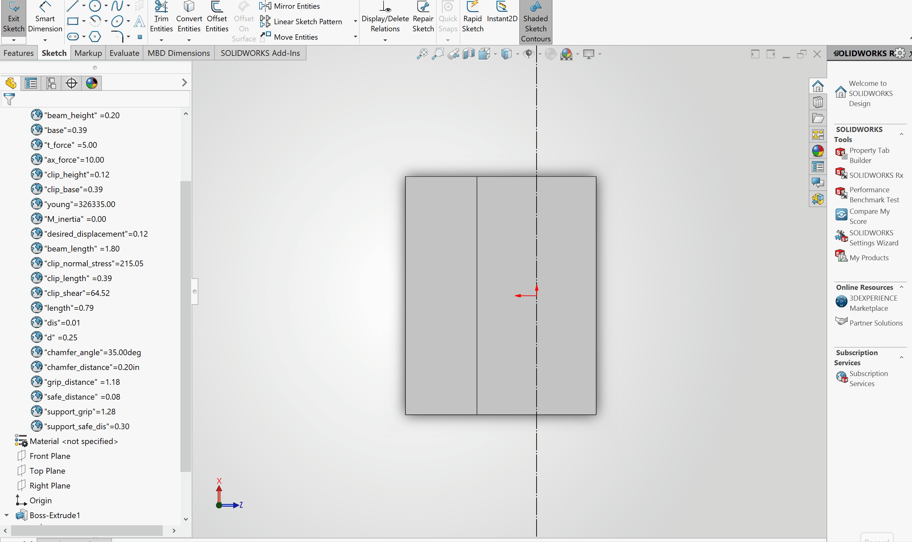

 

Lastly, I extruded it out to a support thickness parameter I later created to make edits. It was originally set to the thickness I originally wanted (3/10 of an inch), and I ended up sticking to it so the parameter was unnecessary.

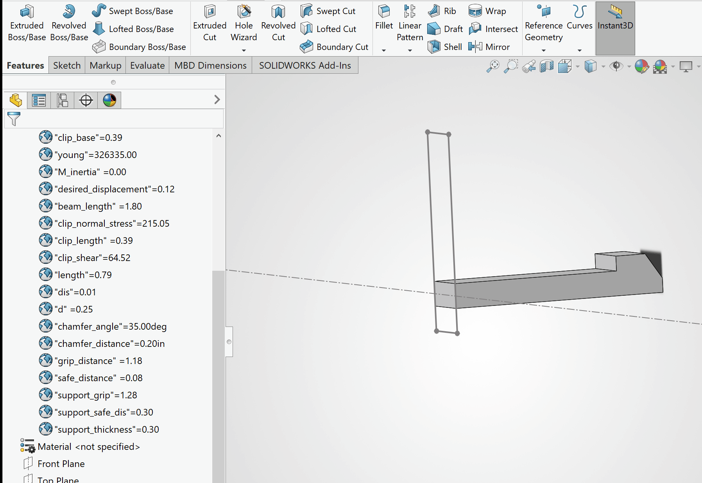

#### Filleting the Interior Edges
After selecting the chamfer tool, I selected every single interior edge on of the snap fit. Then I set the radius equal to the parameter I had created for it. Keep in mind that after creating the block, I came back here and deleted the fillet of the protrusion.
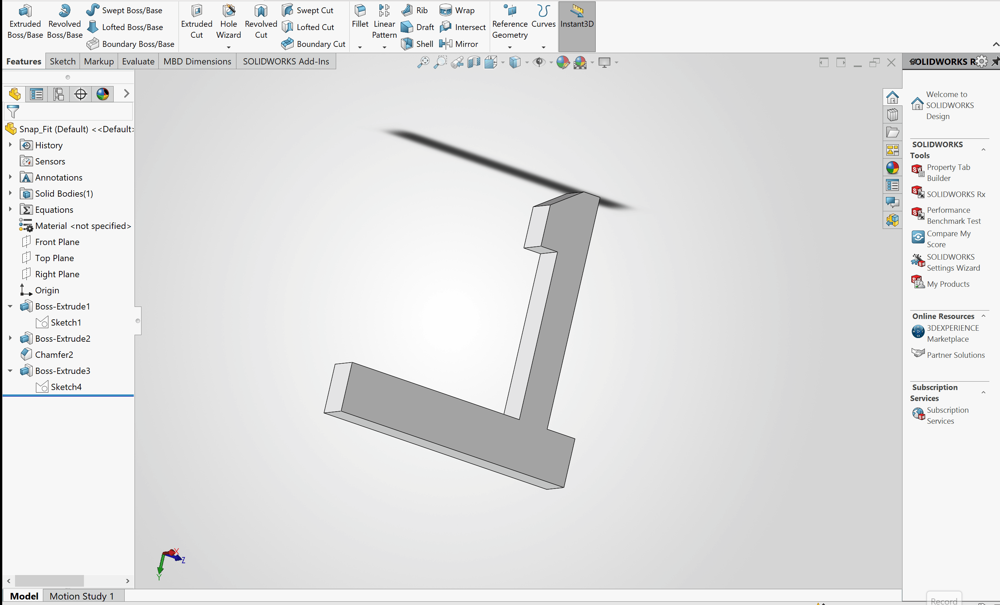

#### "Mirroring" the Snap Fit
After having to manipulate the chamfer several times, it seems to glitch out my file and create a "phantom" chamfer. After trying to mirror the half of my snap fit to make it whole, I constantly kept having errors saying a chamfer was causing issues. After an hour of testing, I realized it was the ghost chamfer and that the only way to fix it was to recreate the part. To not have to waste time doing that, I decided to just make an assembly to workaround and create my own "mirror". Since the snap fit was symmetrical along the axis I needed, all I did was create an assembly and mate the two snap fits halves at the gaps center.

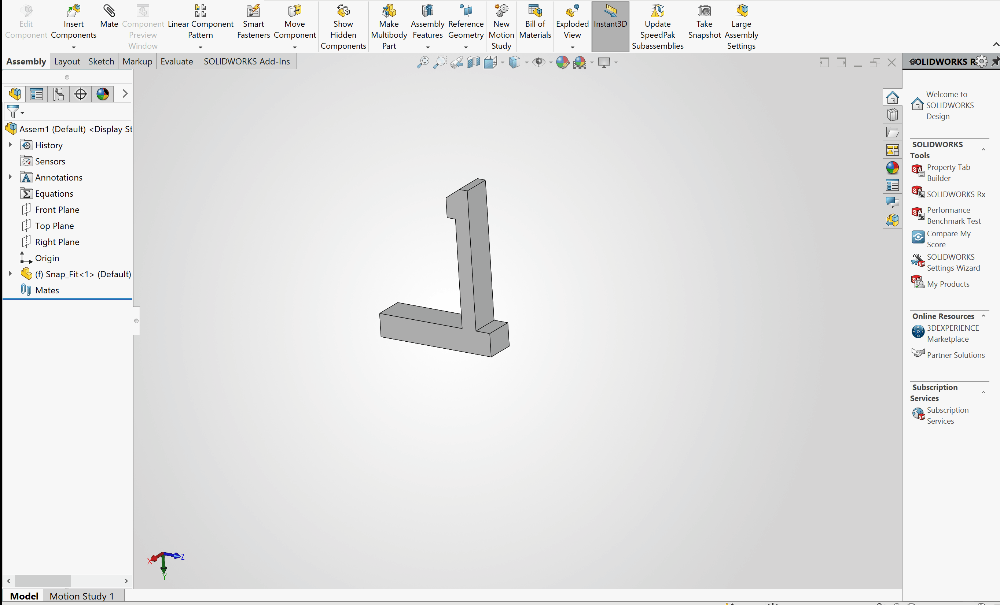

With the assembly finished, I exported the file as a step file. 

### Parameter Choices for Snap Fit
Before creating any ideas for the parameters. I exported all my parameters for the snap fit to a file and then imported it into the block part. This was so that I did not have to retype in any previous work I made that I will used for the block

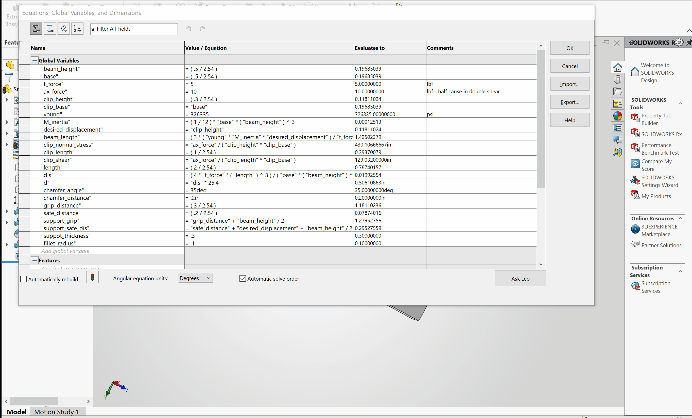

 

Once that was done, I created parameters for the dimensions of the block. The base and height parameters were unnecessary, I ended just making it 1 by 1.5 inch since it seemed like it gave a good enough gap on all side edges from the center hollow slot. Plus I guessed it would be more then enough to grab when testing the object. Then I roughly estimated the thickness of the block by using the measure tool to see the inner distance from the leverage to the protrusion then subtracted it my finger thickness. Instead of making it a tight fit, I reduced the resultant to exactly 1 in to give a littler gap with a clean number. In the end, I ended up just printing the part out to see if it worked and it was good enough to keep that I made no changes.

What was important was the clearance needed for the snap fit to be placed into the blocks slot. However, clearance gaps vary by printer and how a printer is setup, so I was not sure what tolerances I should have gave for the Prusa Core One+ printer. Since I decided to go down the route of just printing and testing, I decided to make this a parameter to make edits if it didn't fit correctly. While I did make a tolerance/clearance test for the first lab and found that the specific printer I had used gave a clearance gap between 0 to .1mm, the printer I was likely to use would be different. Plus, the test I did make was for circular objects, and I had learned that different shapes can make a massive difference on tolerances. Circles in particular can uniformly change from thermal stress, but shapes like rectangles are less inclined. Lastly, we were told that the "lip's height of the flexure needs slightly smaller than the deflection", and when I read this at the very beginning I decided that I would take this into account by moving it to the clearance gap. For those reasons, for my first try I decided to give a .25mm gap for both sides of the snap fit in the direction that they are bending. Next, for the clearance along the sides of the snap fits (parallel to the bending direction). The size of the clearance gap here does not need much thought. Since no important parts of motion or the application of forces are affected here, and as long as the gap is decently sized to allow movement, any reasonable clearance works. For that reason I decided to just give a 1mm clearance gap. A rather big size, but I wanted to try out supports on the block so this gives a back up if the supports create issues. Lastly I set up the parameter equation for the hollow box set up. For the long length where the bending shall occur I simply added the clearance I chose, added double the size of the gap parameter I calculated for the snap fit, and added one beam height length since the gap parameter has half a height beam included (times 2 give once beam height). Then I simply added the beam height plus the clearance gap for that section to create a parameter for the short side of the hollow fit.

After printing the block, I found that my clearance choices were well within an acceptable range so I decided to no use up a printer or more material and stuck with it.

### Creating the Block in CAD.
The block is significantly easier to create
#### Making the Block
To make the block, I created a sketch on a plane used the center rectangle tool to create a rectangle on the axis to make the hollowing easier. Then I used my base and height parameters set the dimesions of the block.

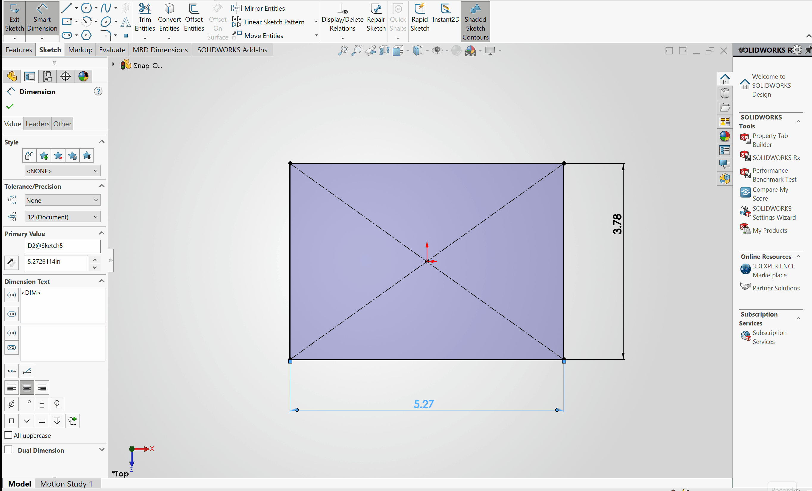

 

After that, I extruded the part by the parameter thickness I chose.

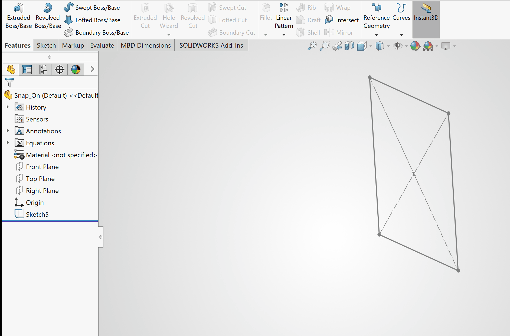

#### Hollowing the Slot
Next, I created the sketch on the base/height plane of the block. Again, I used the same rectangle tool and placed the center of the rectangle on the axis. Since the axis was at the center of the block, all I had to do was add the last parameters for the slot.

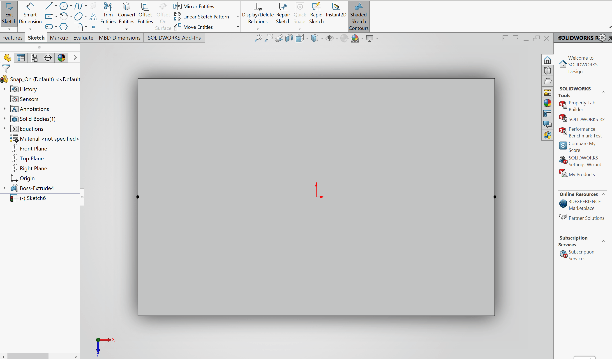

  

Lastly, I extrude cut all the way through the block

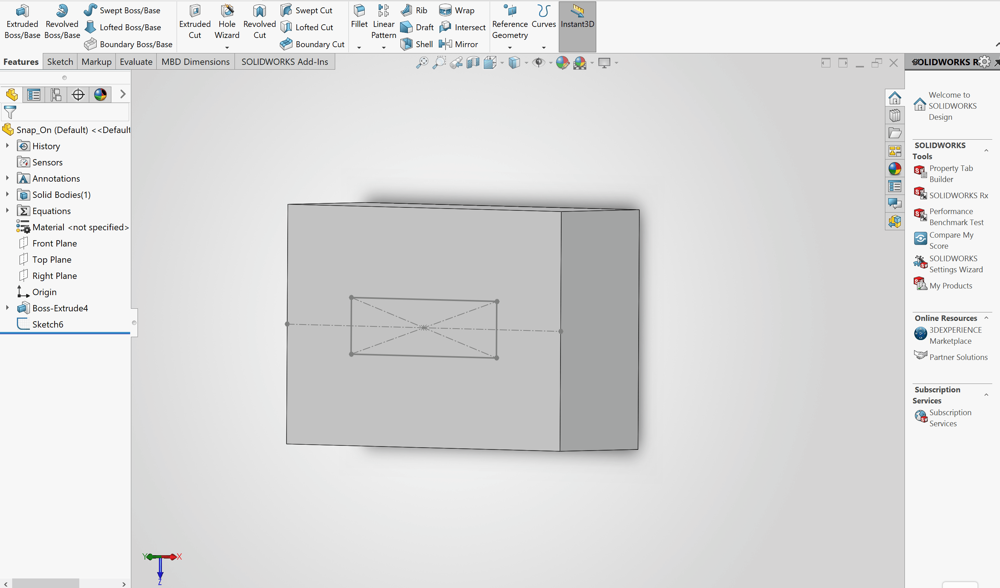

With the block finished, I exported it as a step file

## 3D printing 
### Print Orientation
#### Choice of Print Orientation
Having a rough idea of how printer orientation matters for 3D printed parts that will face bending and tension, I decided to lay the snap fit onto its flattest side. With the block I created, I did not have to meet this criteria. If it did, I would have to orientated it the same way as the snap fit, however, I wanted to try out one of the supports I have not used before. Therefore I set it up so that I had to use supports for the hollow section.
#### Why does the print orientation matter? 
Print orientation matters in this case due to how compressive, tensile, and bending stresses interact with the layers of the print. The layers are actually weak points because each layer is printed separately. Before the next layer finishes, the previous one cools down a little before the next layer is put on top. Because of this, the layers do not stick together as strongly as the material within one continuous printed line.
 
So how does orientation relate to the different types of stresses? [Using this wonderful article for guidance](https://blog.rahix.de/design-for-3d-printing/).  For tension stresses, it is best to orientation the part so that layers parallel to the stress will have its layers work with the grain. Since the layers lines are being pulled, it is like pulling on a rope. If the tension stress was applied perpendicular to the layers, it is essentially ripping the layers away from one another. Compression stresses are the complete opposite for orientation. When applied perpendicularly, it essentially pushes the layers together making it stronger. When applied parallel, it creates shear stress and buckling at the layer, causing the layers to easily separate and bow outward. For bending, the orientation is  more situation based. What is certain is that the layers should never be perpendicular horizontally to the bend. In some cases, perpendicular but vertically works, and other times the lines being in the direction of bending works better. The article I referenced luckily talked about my exact snap clip design, and it states that some areas of the part are also placed under tension. Because of this, it is important to orient the part so that the bending forces are aligned with the print surface, which can help improve its strength. This last part specifically means I had made the right choice.

### Supports
The entire reason I chose the wrong orientation for the block was so that I could try out the strange "organic" support setting that looks like trees. I did so after [reading this article](https://www.sovol3d.com/blogs/news/3d-printing-support-settings-explained-how-to-get-cleaner-easier-to-remove-fdm-prints), where I learned that it reduces the amount of supports having to print on top of surfaces of the model by making branches start on the bed itself. Also, I learned that it creates small tips at the top of the branhecs which greately reduces surface scarring. Lastly, since minimal contact applied because of the last two points, it makes taking the supports off far easier than other kinds. This was certainly the case when I finished the print job.

### Infill
As stated from the very beginning, I decided on using a gyroid infill with 50% infill. Since the snap in is a mechanical part, I chose a 50% infill because I learned from previous labs that it is usually the minimum recommended infill percentage for the mechanically moving parts. Next I chose gyroid because it was a jack of all trades for bending, compressive, and tension strength. This combo allowed for a strong young's modulus without wasting too much material or print time.

### Walls
Similar with infill, the minimum number of walls for mechanical parts is 3. Since the beam was rather thin, I decided to use 3 walls to allow the gyroid to do the rest of the work to decrease the print time. 

## Mistakes
One of the worst mistakes an engineer can possibly do is forget the safety factor. Missing something this simple could lead to structures and technology breaking down and causing harm for others. I was incredibly upset with myself that I forgot this basic component in my math. Luckily, this was not a critical component and I will learn from this.

## End Result and Test
Although I forgot to include the safety factor, the end result came out great. Honestly, I was suprised that I had missed that, because I had tested the object several times and very much bent the snap in considerably. I simply couldn't tell that there was yielding issue even after applying a good amount of forces that should have cause serious yield.

 

<iframe width="560" height="315" src="https://www.youtube.com/embed/kjWDgH3GzPg?si=8kg98lPNClm9FBQf" title="YouTube video player" frameborder="0" allow="accelerometer; autoplay; clipboard-write; encrypted-media; gyroscope; picture-in-picture; web-share" referrerpolicy="strict-origin-when-cross-origin" allowfullscreen></iframe>

## Lessons learned
This project was mostly a continuation of what when have been doing in both parts of these sections. However, the biggest thing I learned was how orientation is important to consider when making parts that will face serious stresses. More specifically, what new thing I learned is how the orientation should be set specifically for bending.

## Time
This project took me 12 hours to complete

## Resources
### Websites
1. https://link.springer.com/article/10.1007/s00170-020-06138-4/tables/6
2. https://www.matweb.com/search/DataSheet.aspx?MatGUID=ab96a4c0655c4018a8785ac4031b9278&ckck=1
3. https://blog.rahix.de/design-for-3d-printing/
4. https://www.sovol3d.com/blogs/news/3d-printing-support-settings-explained-how-to-get-cleaner-easier-to-remove-fdm-prints
### Physcial
PLA
Prusa Core One+ - PC_14

 
