# Lab 6 – Design Fits for an Artifact
## Approach to the Lab 
Due to the similarities of this lab with last weeks and the fact that my artifact could be attached with the same snap fit, I decided to treat this lab as a part two of Lab 5 and build slightly on it. As will be shown, I decided to stick with the straight beam snap fit.

## Data for Parametric Design
### Known Properties
Building off last week, I will use a [50% gyroid infill has an 2.2 ± 0.05 GPa Elastic Modulus that I found from a study](https://link.springer.com/article/10.1007/s00170-020-06138-4/tables/6). I decided to use the highest possible to ensure the Beam will bend, which is about 326335 psi. Then for the yield strength, I decided on [the PLA data sheet given for A4](https://www.matweb.com/search/DataSheet.aspx?MatGUID=ab96a4c0655c4018a8785ac4031b9278&ckck=1), and I chose its average 6555.706 psi rating for yield strength. This time I will make sure to use the yield strength with the factor of safety.

### Choice of Stress
Not knowing how much force I should build my fit around, I decided to use the selection of transversal forces given in the last lab. So I settled on the highest force of 5 lbf, since a higher force should reduce the length of the fit and also ensures the snap fit wouldn't be damaged by bending. Further more, I decided to ignore the axial force because it had a significantly minor effect on the design of the snap fit. Further more, I decided on using a Factor of Safety of 2. In the last lab, I had completely forgotten the factor of safety yet the part seemed to work fine and only had noticeable plastic deformation after a significant amount of "tests" (I was fidgeting with the part). Although, it can be hard to tell just how much of an affect it had, so I decided on a small factor of safety to ensure I had no issues with a much bigger snap fit. Lastly, the protrusion will be thicker, so adding the factor of safety should help allow going further then the displacement needed to get the snap fit in. 

### Measurements of the Artifact
The artifact I was given was a LCD screen with several attachments. All these strange attachments made it difficult to find a decent way to connect a snap fit. Except the big gap between the LCD and the potentiometer. This is when I realized that I should use a similar snap fit to last weeks.

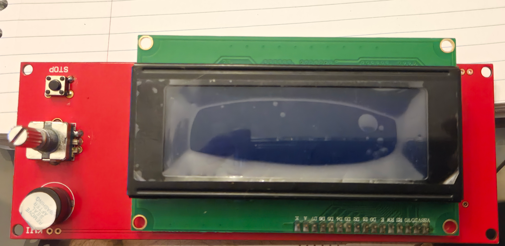

#### Top View
My idea is to limit the directions of movement of the snap clip connected to LCD by using the LCD PCB and Buzzer as blockers. Using a caliper, I roughly measured the distance from the buzzer to the LCD (which I will use as my beam's base), the length of the space the snap fit will connect to, and the distance from the edge to the buzzer. One issue with this set up is that on the other side that button is a further distance away, this is ok because this direction of movement does not require limiting it completely and the button gap is not significant.

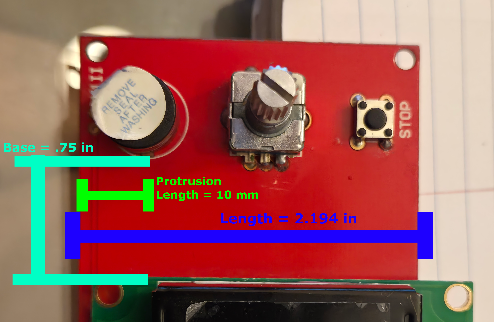

#### Front View
There are two issues that need to be addressed. For one, there is a gap between the LCD PCB and the red breadboard. That means that the protrusion will slide in-between them if it is not thick enough. To avert this issue, I measured the distance from the surface of the red breadboard to the top of the PCB. This gave about .16 inches. However, I needed to add an angle to the tip of the protrusion to allow the LCD board to slip in. As seen in the picture the edges of each are not aligned with one another, so if I add an angle, the angle could lower the thickness enough that it would slip off. Therefore I decided to raise the protrusion thickness to .23 inches. Below is what this affect had on the 3D print job. 

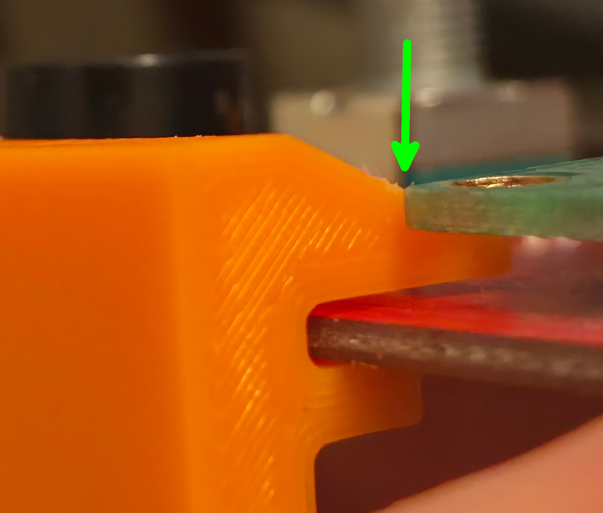

 
The second issue was that the LCD board would be free to move along the length of the beam, so I had to add a bed on which the LCD board could lay upon once its gets past the protrusions. To do so I will need the thickness of the red board. Which I measured to be about 1.7 inches, however, I decided to add .45 mm to the gap to ensure it will fit. 

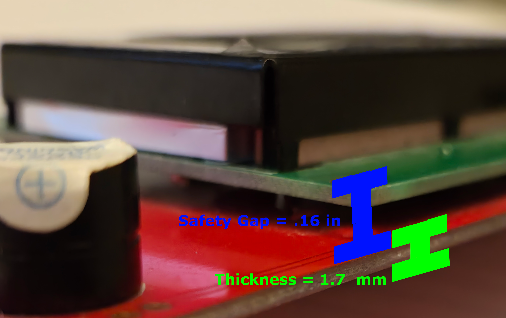

## Equations for the Parametric Design
### Rough Sketch of Design
Before understanding what equations to use, I need to known the setup that I am using. As seen in my rough sketch below, I decided to stick with the same beam design of the last lab, as in a pair of straight beam snap fits. The difference this time is that the displacement will occur outward from the center instead of inward. Additionally, I will be adding a thin pair of protrusions (that won't affect the math) to allow the red board to lay on top of. 

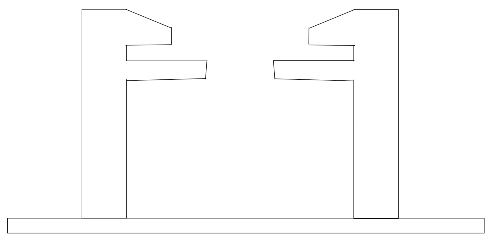

### The Height and Length of the Beam
The worst sin I committed in the last lab was that I forgot to divide the yield strength by the safety factor when calculating the bending shear stress my length found via the displacement caused. To ensure this time that the bending yield stress and the displacement would be in sync with one another, I decided to warp their equations to somewhat equal one another. As in, I rearranged the equations so that they were equal to length, equated one another through this, then solved for height. What this will do is ensure that the yield strength, safety factor, and displacement would forcibly work together to find a height (and then length) that satisfies all of them. Once I find the length, I only have to plug it back into one of the length equations I found, both of which will give the same length. Then I have ever main equation I need to solve it. Below is how I derived it.

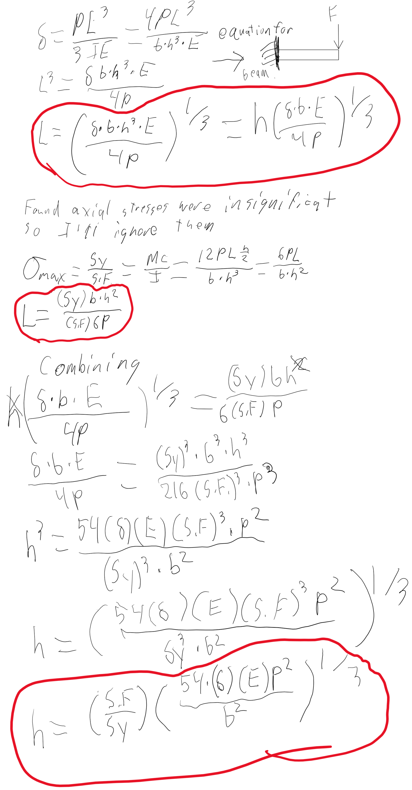

## Adding Everything to SolidWorks Equations 
SolidWorks Equations will be how I will parametrically design this model since I will be able to plug in all data and equation outputs directly to dimensions in the model. Keep in mind that this is for half the snap fit and one beam. Also, note that it seems that everything is already solved, even before the creation of the snap fit.
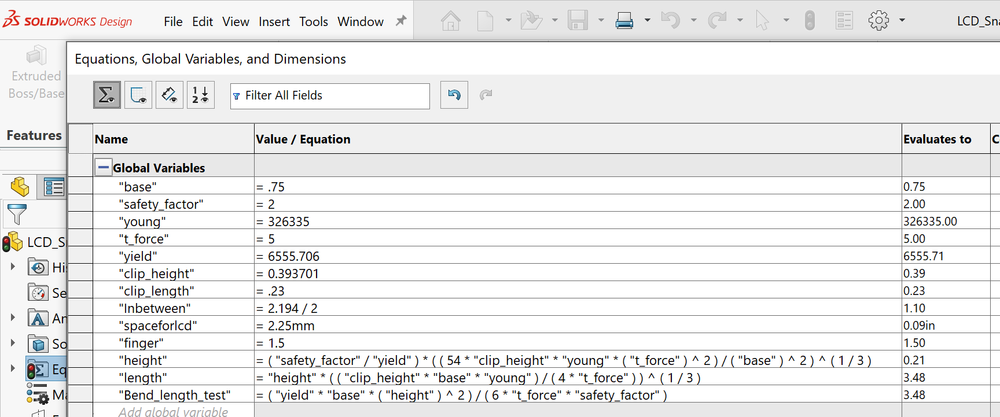

 

To explain the variables I will create a list
1. "base" = the base of the beam found by the distance between the PCB and the Buzzer in inches
2. "safety_factor" = Is self explanatory, it is set to my chosen factor of safety
3. "young" = The modulus of elasticity of 50% gyroid infill PLA in psi
4. "t_force" = The chosen transversal force being applied to the beams in lbf
5. "yield" = The yield strength of 50% gyroid infill PLA in psi
6. "clip_height" = How much the protrusions sticks out from the surface of the beam, found by measuring the distance from the edge of the red board to half the diameter of the buzzer inches. This also acts as the displacement.
7. "clip_length" = A poorly chosen name, it is essentially the thickness of the protrusion in inches.
8. "inbetween" = Essentially is half the gap between the pair of beams to simply mirror the two.
9. "spaceforlcd" = Is the gap between the protrusion and where the red board will lay on, which is essentially the thickness of the board plus .45mm. This is automatically converted from mm to inches
10. "finger" - The length of the two sides facing away from the beams to give a little grip. I gave it a length of two of my fingers
11. "height' - This is derived height equation I created which outputs the height of the beam.
12. "length" - Using the displacement formula and the found height, I calculated the length
13. "Bend_length_test" - This also solves for the length via the bending stress equation to prove that they would give the same output

## Creating the CAD Part
### Creating the Beam
#### Cross Sectional Area
To start, I created a rectangle and plugged in the (calculated) variables for its base and height.
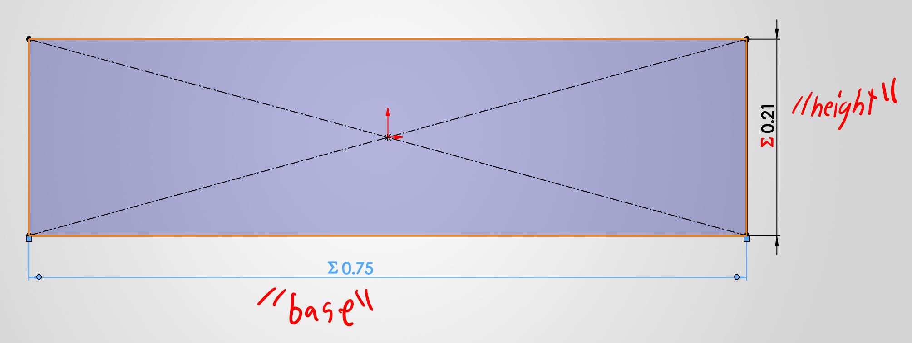
#### Extrusion
Then, I extruded the length to the calculated length variable
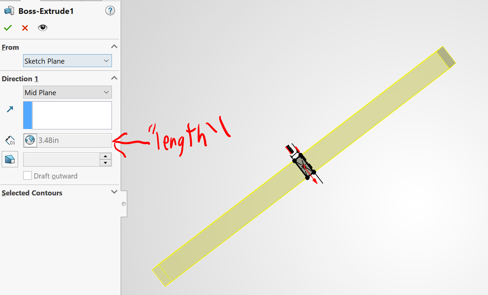

### Creating the Protrusion
#### "Base" of the protrusion
Next, I added a rectangle along the outline of the beams flat surface minus one side. This creates the protrusion's base and I set the distance from the edge to the open side as the thickness of the protrusion.
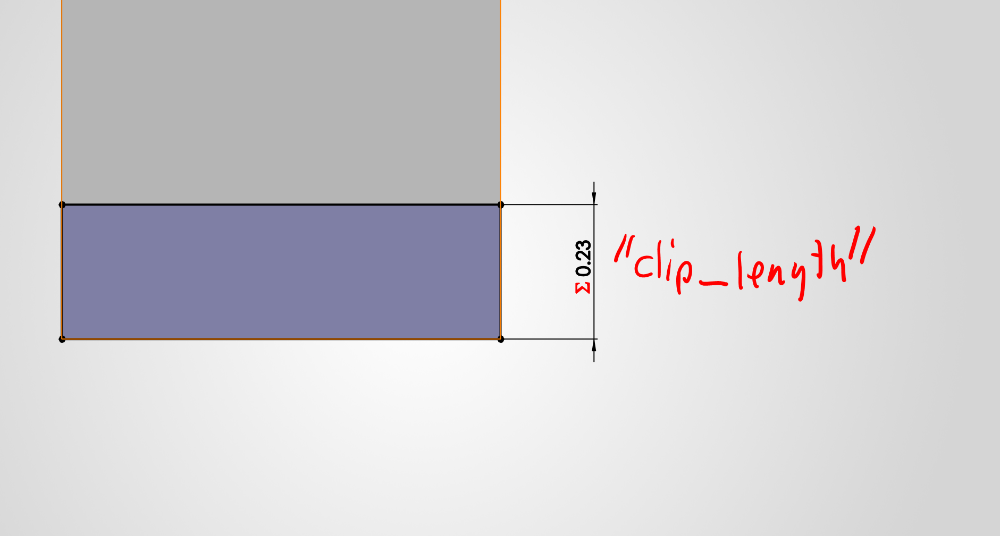

#### Extruding the Protrusion
Then I extruded the protrusion away from the beam with its "height" variable 
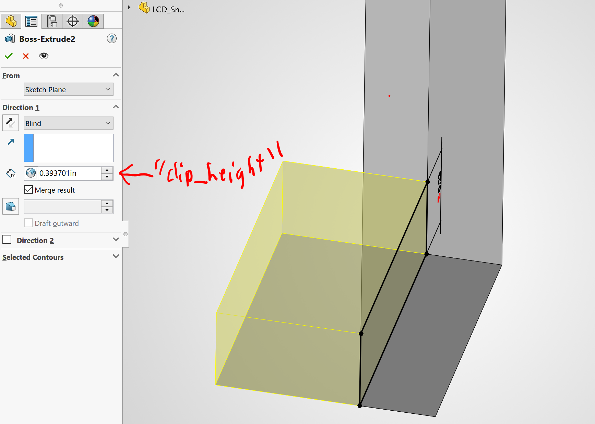

### Creating the Hub of the Snap Clip
#### Hub Sketch
In order to connect the two beams together and keep them at the required distance, I need a hub. I created a reactangle at the "wall" section of the beam, then I pushed one side of the rectangle toward the center of the snap fit with its respective variable. Then I pushed out the rectangle out to the side that will allow a little bit of grip. 
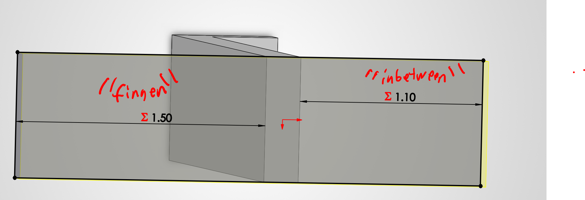
#### Hub Extrusion
The distance of the hub extrusion wasn't extremely important, so I gave it a .2 inch thickness to save on PLA and on print time. If anything, the somewhat thin thickness can help the snap fit to bend outward a little bit easier. 
 
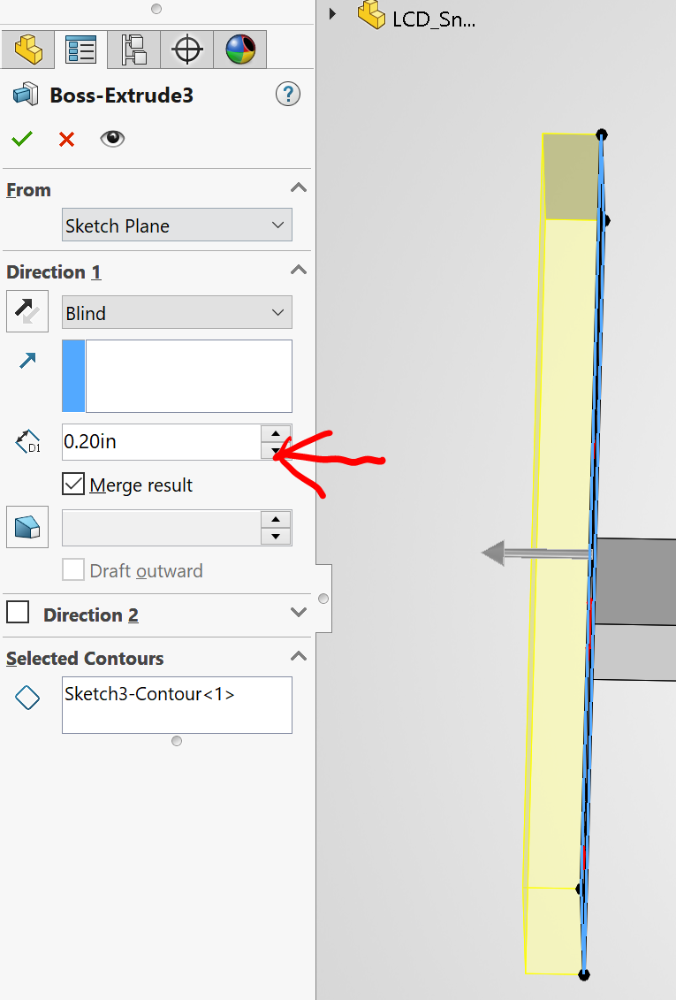
 

### Bed for Red Board
#### Bed Sketch
To create the "base" for the bed, I created a rectangle on the beam, only connecting the rectangle to the sides of its base. Then I gave the gap for the red board to sit in using gap variable I decided on. The thickness of the bed was chosen to be an even .10 inches for simplicity and (as will be shown later) an additional "component" will be added to give more structural rigidity.
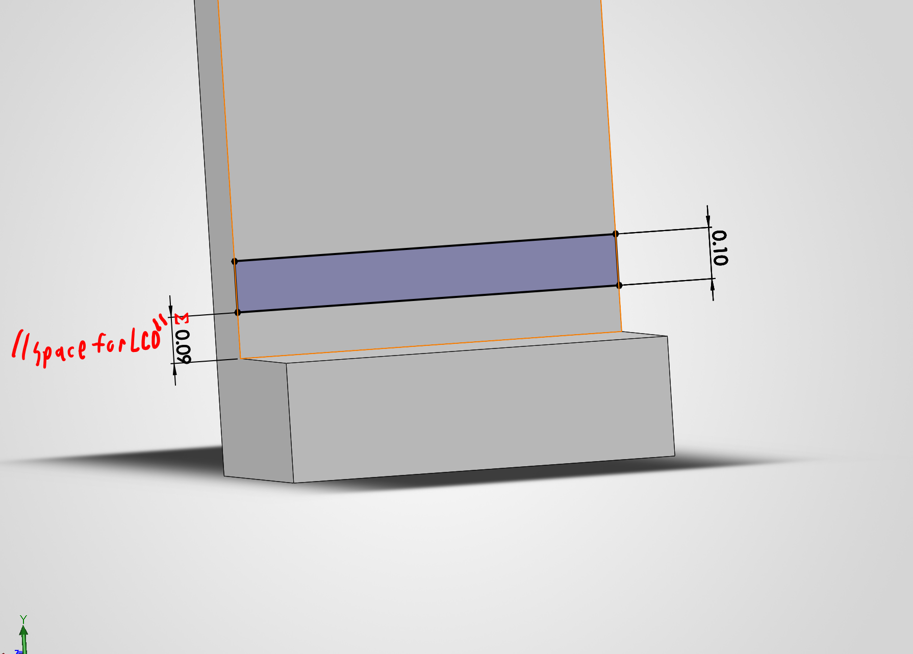

#### Bed Extrusion
This is where I initially made an error. The first time I printed my snap clip this, I made a silly mistake by extruding these beds way too small. To the point that they were smaller that the protrusions extensions. This meant that when I tried to push the board in, it would just go right past them. 
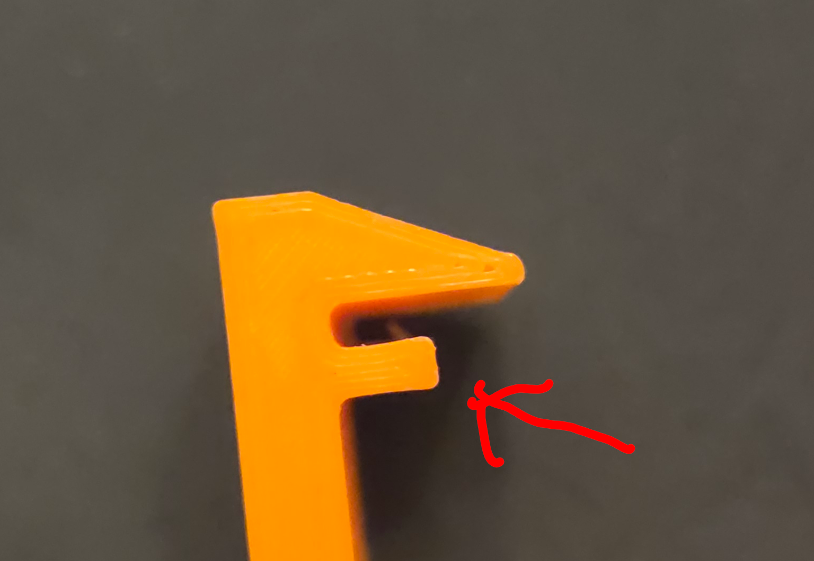

To fix this, I decided to increase the extrusion further to .9 inches. I chose .9 since it is a clean number and gave a long distance for the bed to rest. Additionally .9 inches was slightly less then half the red boards length at this section so that there a was decent gap between the beds on each beam to allow bending.
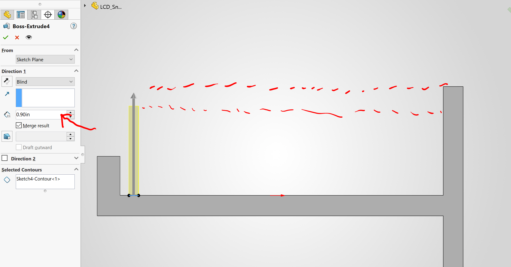

### Chamfering the Edge of the Protrusion
The last main basic structure was finding the correct chamfer for this Snap fit was a guessing game due to the weirdness of the gap between the PCB and the red board. I had to make sure that at least parts of the protrusion were hitting the PCB while having the angle start at the edges of the red board. It was a balancing act between an angle that can guide the redboard into the snap fit, the ability to allow the red board to slip in, to not allow the protrusion to slip under the PCB, and the not make the tip too thin. The closest I could get was a poor 66 degree angle and a .18 inch depth. This is a critical flaw with the design, because this means that it could take a significant amount of axial force (still not much stress) to make the beams bend outward. There maybe fixes for this, but by the time I realized this was an issue, it was already too late to fix. So I had to apply a good amount of force for it to work. 
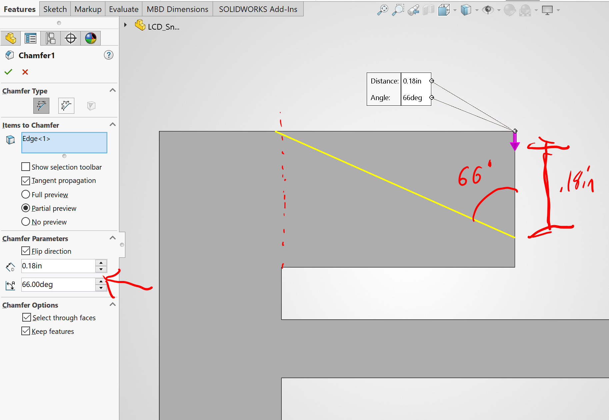

## Additions to the Snap Fit
### Curving to Get Rid of Bumps
One issue I fasted after printing a prototype was that there were tiny bumps at the tip of the protrusion. These slightly blocks the red board from sliding in by causing "friction" that required more force to over come. This likely comes from the fact that 3D printers can have a rough time printing at small peaks. It can be hard to see with a camera, but it can slightly be seen at very edge in the picture below 
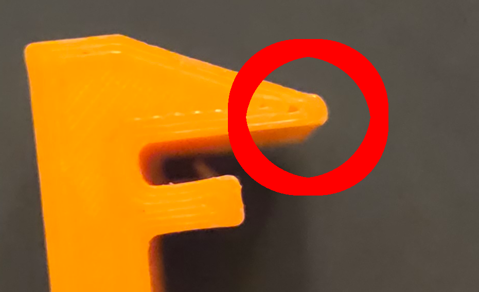
In order to combat this, I decided to fillet the tip slightly. That way it reduces the chance of the bumps causes blockage, and may even make it slightly easier to move in vs just a sharp edge. By eyeballing the bumps and comparing it to the 3D model, I decided on a .05 inch radius fillet.
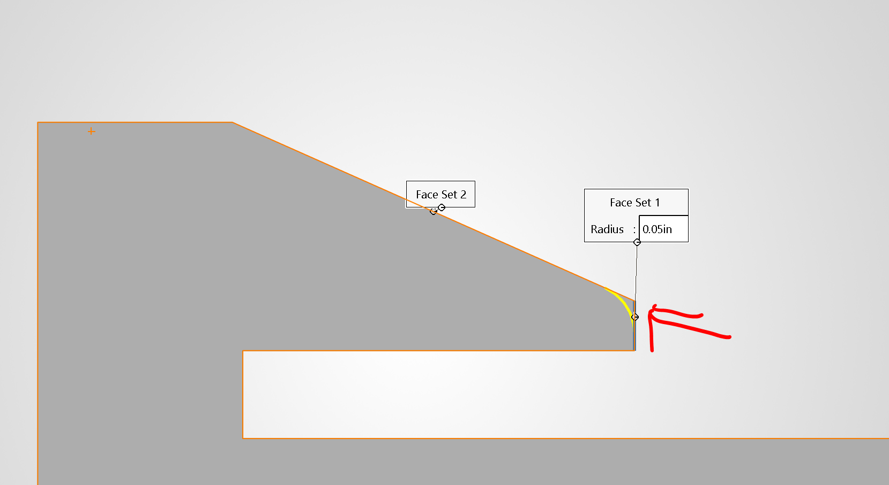
### Support for the Red Board Bed
One thing that I was worried about after extending the bed length was that it could easily break if I applied enough force to the bed for it to get into the snap fit and right afterwards the board rammed right into the bed. Breaking it. To mitigate this risk and give more support for the bed, I decided to fillet the beam surface to the bottom of the bed. That way it gave support while still allowing some bed. I chose .05 inch radius to allow .9-.5 = .4 inches of the thin part of the  bed to stick out to allow some bend there if need be. 
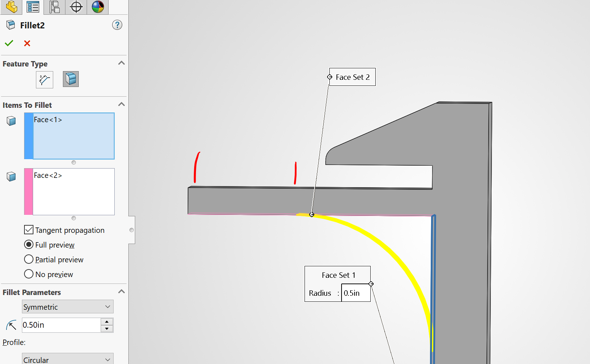

## Last Touches 
### Making the Complete Snap Fit
To finish the model, I needed to mirror it at the half way point of the redboard's length. The problem is that the mirror function was giving me issues similar to last week, so I decided to not waste time and just make an assembly and "mirror" it via mating. 
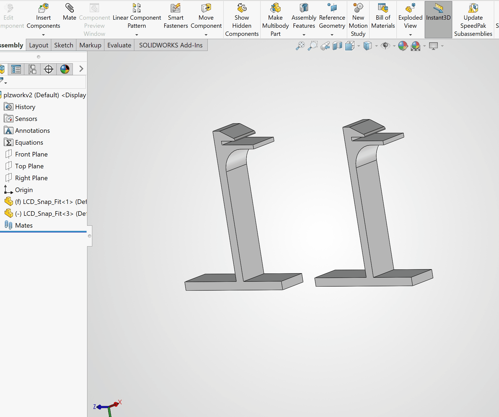
### Finished Model
With that, the model is finished.
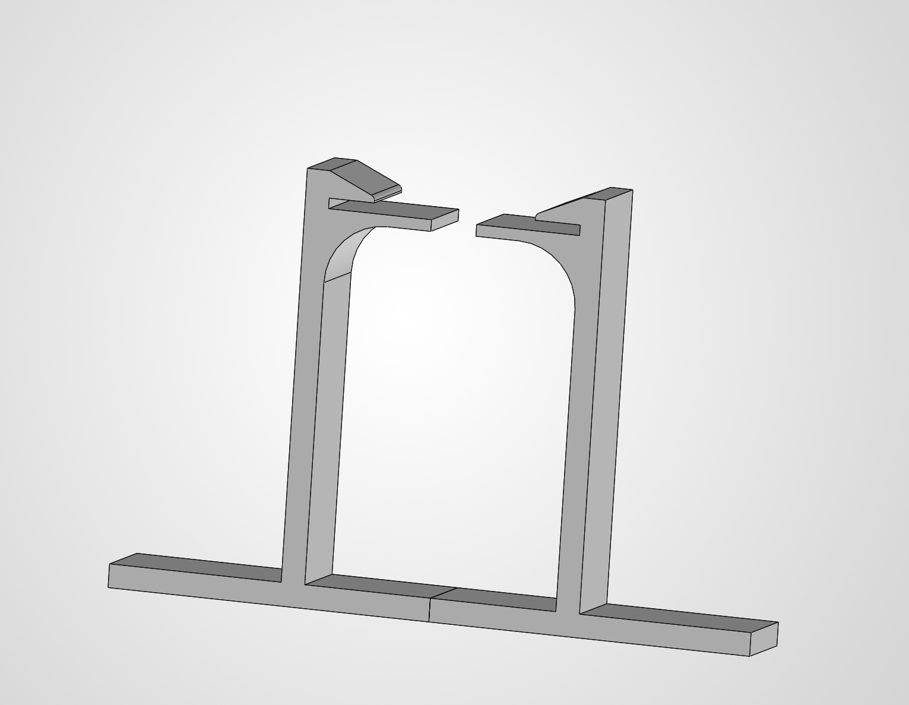

## Creating the G-Code
### Exporting as a Step File
STL files can be a pain to give accurate curvatures on models, to bypass this I export the model as a STEP file to give a high quality file for PrusaSlicer to work with. So I exported the file in SolidWorks
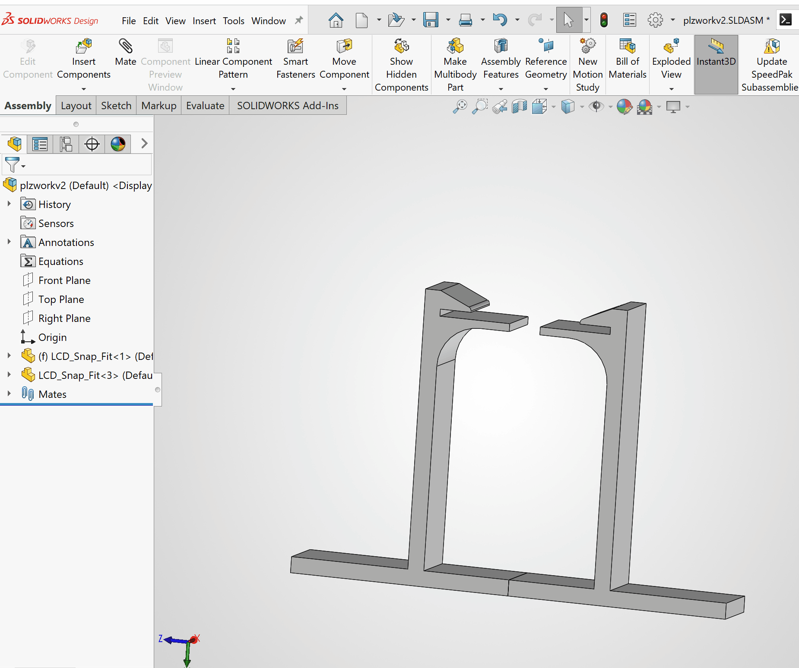
Then I dragged and drop the file into the slicer and set all settings to the max 
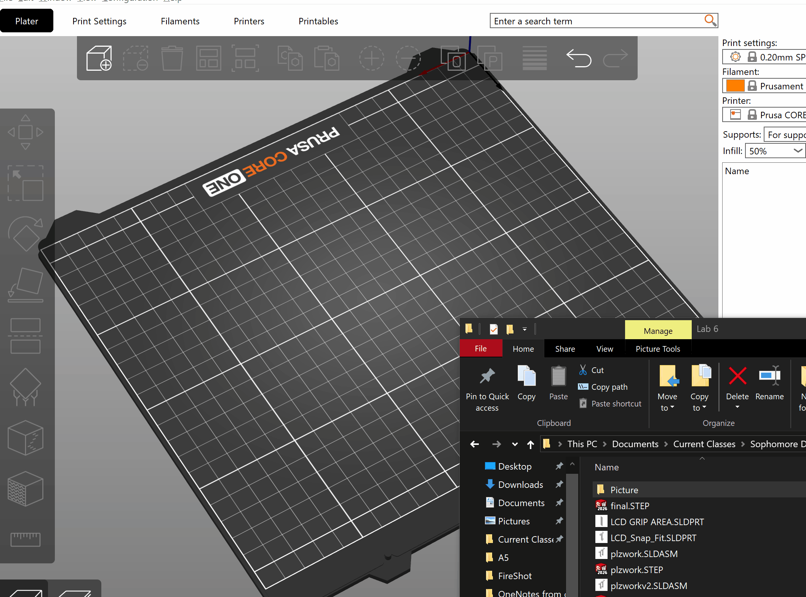
### Build Orentation
Based on what I learned about how print orientation affects parts subjected to bending and tension in the last lab, I decided to place the snap fit on its flattest side. 
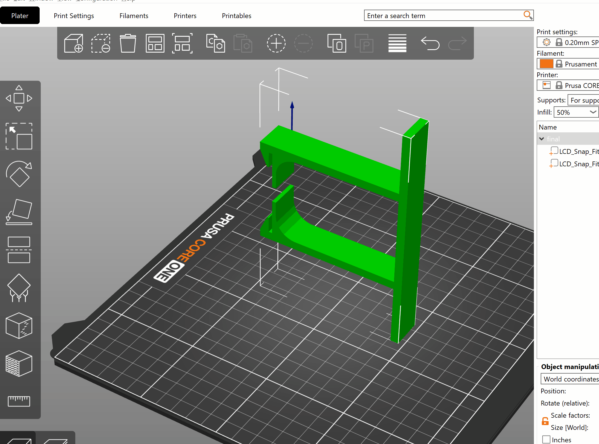
#### Recap on Why the Print Orientation Matters

Print orientation is important because the layers of an FDM print can act as weak points when a part is subjected to tension, compression, or bending. Each layer is deposited separately, allowing the previous layer to cool slightly before the next is added. Because of this, the bond between layers is generally weaker than the material within a continuous extrusion.

Bending is  complicated because it combines both tension and compression. When a part bends, one side of it is placed under tension while the opposite side is placed under compression. Because the layers are weaker at their interfaces, an unfavorable orientation can cause the tensile side to pull the layers apart or allow the layers to shear and separate as the part bends. For this reason, the layers should not be oriented horizontally and perpendicular to the direction of the bend, since this can make the layer interfaces the main points resisting the bending force.

The best orientation for bending depends on the shape of the part and how the force is applied. In some cases, having the layers perpendicular to the bend vertically can work, while in others, having the printed lines run in the direction of the bending force provides better strength. What I learned in the last lab was that the snap fit should be oriented so that the bending forces act along the print surface rather than trying to separate the layers. This is why placing the snap fit on its flattest side was the appropriate orientation for this design.

### Supports
Supports were completely unnecessary for this print job since there are zero overhangs

### Infill
I used a 50% gyroid infill for the snap fit. Since it is a mechanical part that experiences bending and tension, I chose 50% based on what I had learned from previous labs about the minimum infill typically recommended for mechanically loaded parts. I selected the gyroid pattern because it provides a good balance of strength in tension, compression, and bending. This combination provided a strong part without unnecessarily increasing material usage or print time.

### Walls
As I have learned, three walls is a reasonable minimum for a mechanically loaded part. Extra wall passes allow adjacent hot extrusion lines to thoroughly overlap and fuse, reducing the risk of microscopic gaps or splitting under strain. The lower value provided the necessary strength while keeping the amount of material and print time relatively low. Since the nozzle is .04mm and that there was 3 walls, that meant it had a wall thickness of 1.2mm

### Layers
I decided to set the .2mm speed layer setting for several reasons. For one, due to the already taking 1 hour to complete at this setting, I did not want to hog the machines in case I had to print multiple times to include tolerances. Second, I had several events going on during the only day I was able to print this, so I had to ensure that it would complete on time. Lastly, this part did not need highly detailed layers since shaped in the z axis direction were incredibly simple. With this setting, the printer laid 95 layers.

### Dimensions
In PrusaSlicer, the model is said to have a length of 142.4mm in the x direction, a length of 93.5mm in the y direction, and a height of 19.05mm in the z direction. This means that the build volume of the model is 142.4mm * 93.5mm * 19.05mm = 253639.32 mm^3 = 0.00025363932 m ^3. The build volume of the printer itself is [250mm x 220mm x 270mm](https://www.goodprints3d.com/blogs/3d/prusa-core-one-build-plate-size-and-build-volume-what-you-actually-get) = 14850000 mm^3 = 0.01485 m^3

### Brim
Unlike the last lab, I decided to add a brim. I did it so that the bed that was thin and sticking out at a .4 in length would not wrap and raise up after the first couple layers

### Print Time
The Slicer stated that it would take 1 hour and 10 minutes to complete

## Printing the Object
### Printing
I used the PC_03 printer. Due to being incredibly busy, I was not able to witness the entire print. However, I was able to get the print towards the beginning.

  <iframe
    src="https://www.youtube.com/embed/Nzlz4gFMM8s"
    title="YouTube Short"
    style="width: 100%; height: 100%; border: 0;"
    allow="accelerometer; autoplay; clipboard-write; encrypted-media; gyroscope; picture-in-picture"
    allowfullscreen>
  </iframe>

### Finished Print
In the end, the print came out perfectly with no issues or deformations
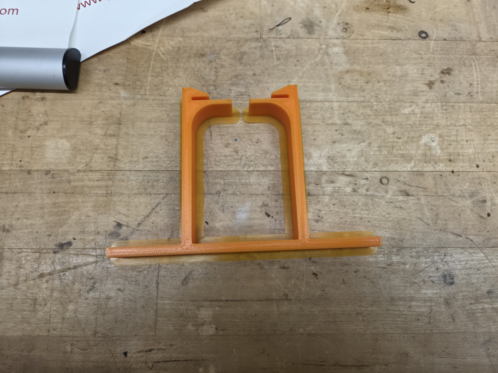

### How does it fit, does it work?
Luckily, I did not have to add any tolerances to the build. The added gap I gave with the bed was all that was needed. After testing, it works, but it is very finicky and requires a decent amount of force

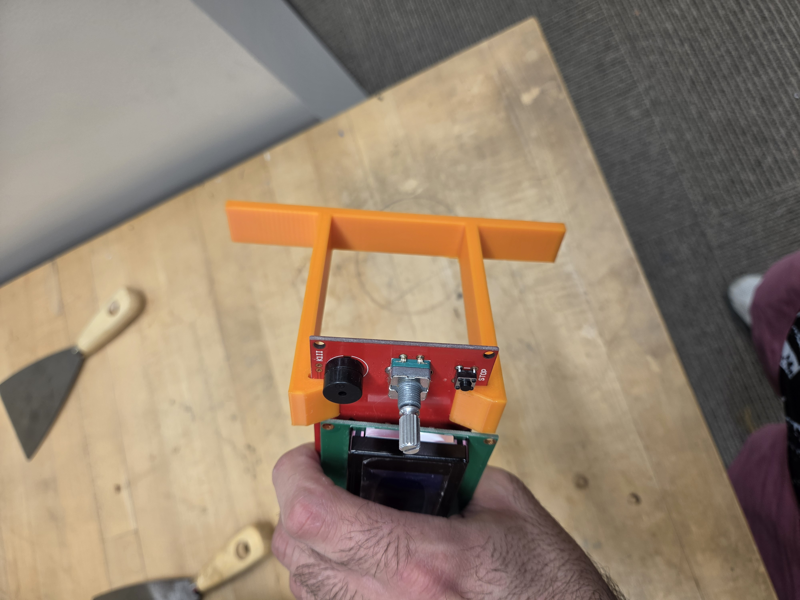

## Lessons Learned
### Learns
Throughout this process, I learned that designing a functional snap fit requires much more than simply calculating the beam dimensions. One of the biggest lessons came from building on the previous lab, where I had forgotten to include the factor of safety when calculating the allowable bending stress. In this lab, I corrected that mistake by using a factor of safety of 2 and rearranging the bending-stress and displacement equations so that they were connected and produced compatible beam dimensions. I also learned that physical measurements and tolerances are just as important as the calculations. The LCD, PCB, buzzer, and red breadboard created several unusual geometric constraints that required me to measure clearances and modify the protrusion thickness and board gap instead of simply using the measured dimensions directly. Another important lesson was that a design that looks correct in CAD may still fail when physically printed. My first printed snap fit had beds that were too short, causing the red board to pass over them instead of resting on them. I fixed this by increasing the bed extrusion to 0.9 inches while maintaining enough space between the two sides for the beams to bend. This showed me that physical testing is necessary because CAD alone cannot always reveal how parts will interact.

I also learned that fixing one problem can create another, so every design change needs to be evaluated for its secondary effects. After extending the bed, I became concerned that the longer, thinner section could break when the board was inserted, so I added a fillet between the beam and the bed to provide additional structural support while keeping some flexibility. The protrusion created another problem because its chamfer had to balance several conflicting requirements: it needed to guide the red board into the snap fit, prevent the protrusion from slipping underneath the PCB, maintain enough thickness, and avoid requiring excessive insertion force. The final 66-degree chamfer worked, but required more force than ideal, teaching me that interface geometry should be tested earlier in the design process. After printing, I also discovered small bumps on the protrusion tips that increased friction and made insertion more difficult. I fixed this by adding a 0.05 inch fillet to smooth the tips. Finally, when the SolidWorks mirror feature caused problems, I stopped trying to force the feature to work and instead created an assembly and used mates to position the second half of the snap fit. Overall, the process taught me that mechanical design is iterative with calculations establish a starting point, measurements determine the constraints, CAD develops the geometry, printing exposes real world problems, and testing reveals issues that can then be corrected. The mistakes in this project ultimately showed me the importance of designing for actual manufacturing and assembly rather than assuming that a mathematically correct CAD model will automatically function perfectly.
### Time Commitment
Took about 11 hours to complete

## Resources
1. https://link.springer.com/article/10.1007/s00170-020-06138-4/tables/6
2. https://www.matweb.com/search/DataSheet.aspx?MatGUID=ab96a4c0655c4018a8785ac4031b9278&ckck=1
3. https://www.goodprints3d.com/blogs/3d/prusa-core-one-build-plate-size-and-build-volume-what-you-actually-get
4. www.youtube.com
5. SolidWorks
6. GIMP
