# A7 – Linkage Mechanisms

## Research
### Scissor Linkage Lift
[I found a scissor linkage lift patent published in 2025 on google patents.](https://patents.google.com/patent/EP4511312A1/en)
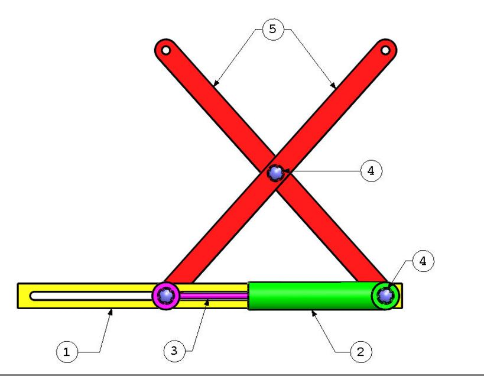 
#### How It Works
The scissor linkage works by using bars that are connected together and cross over each other like an X. When the bottom of the linkage is pushed together, the bars move around their pivot points and the linkage gets taller. When the bottom moves back apart, the linkage folds back down. This allows the mechanism to lift things up and down while also being able to fold into a smaller space.
#### Industries that Use It
##### Firefighting
Firefighting is part of the emergency services sector industry of the government. When fires happen, sometimes people get stuck in a burning building because the way out is blocked. One way firefighters might help get them out is by using a scissor lift to get to higher floors of a building and to bring the victim down safely. 
##### Construction
The construction industry is massive due to the endless need for construction. Scissor lifts are used in a vast amount of ways to easily construct, add renovations, and safely move objects to multiple floors. [Their range of uses are greatly immense,](https://www.workplacepub.com/issues/2023/w0723.pdf) from ceiling work to fixing signs to fixing powerlines. They are so widely used because they provide a safe, efficient way to lift workers and materials straight up to and down from elevated work areas.
### Toggle Clamp
[I found a patent for a highly advanced version of a mechanism called a toggle clamp published in 2025.](https://patents.google.com/patent/US20250223983A1/en)
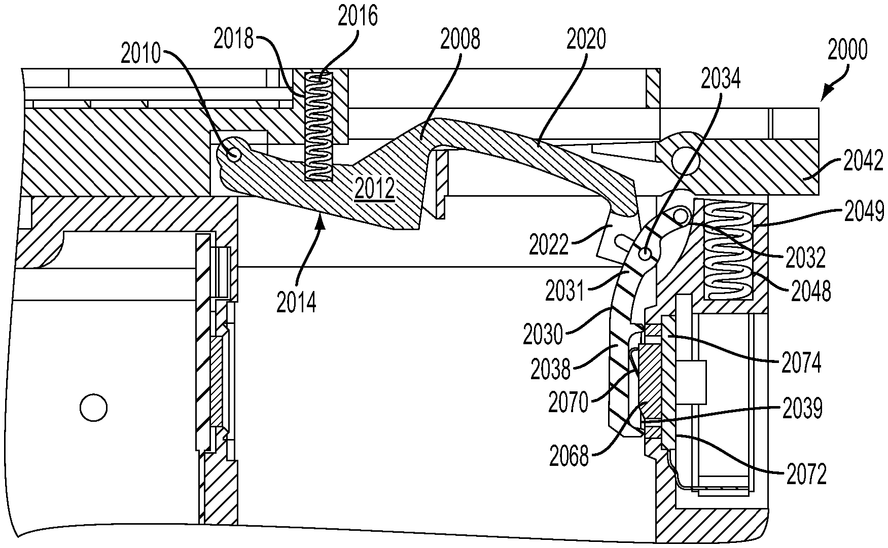 
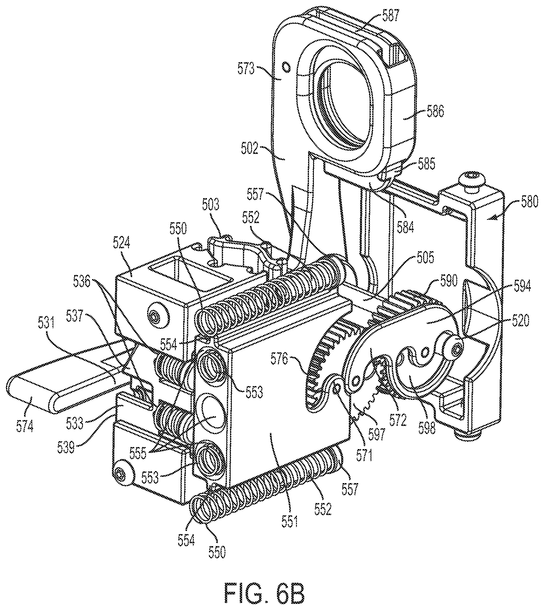 

#### How It Works
A toggle linkage uses a handle that is connected to a few smaller links. When you push the handle down, the links move and straighten out. Once they go past a certain point, the linkage locks in place and holds the object tightly. When you pull the handle back up, the links move out of the locked position and the clamp opens. Overall, a toggle Clap is a simple way to hold something in place without having to keep applying force.
#### Industries that Use It
##### Manfuacturing
The manufacturing industry is one of societies most important industries, cause how else can you buy technology, furniture or most things a modern person uses in their daily life. Toggle Clamps can be used in manufacturing to hold pieces of metal, wood, or plastic in place while they are being cut, drilled, or welded. The linkage keeps the material from moving, which makes the work safer and more accurate. Once the work is finished, the handle can be lifted to quickly release the piece.
##### Automotive
In the automotive industry, toggle clamps can be used to hold car parts in the correct position while they are being assembled. For example, a clamp could hold a metal panel or another part in place while workers attach or weld it. This helps make sure the parts stay aligned during the assembly process.

## Design
When we were told to design a working linkage mechanism, I instantly knew that I had to make a claw grabber like in the image below.

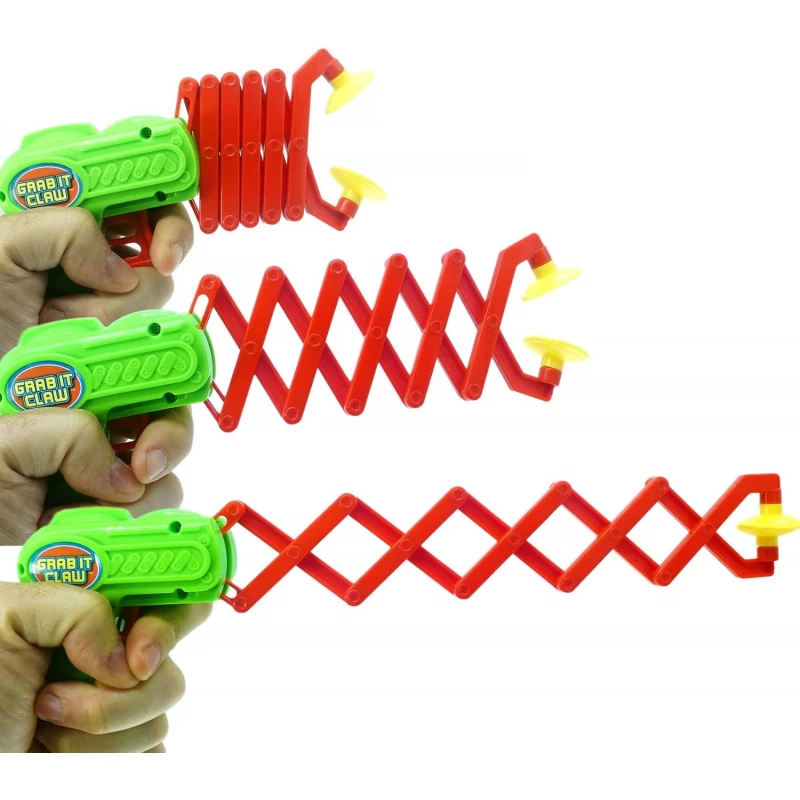

### Purpose 
The purpose of a claw grabber is to grab items from a distance. By usingjm mmmmmmmmmmmmmmmmm7jnnnnnnnnnnnnnnnnnnnnnnn x-cross linkages (creating a scissor chain) at the pins at the center of the line of symmetry, when puling together one end of the mechanism it extends the claw grabber and does the opposite when pulled apart. I chose to design it because it is a classic toy with an extremely obvious use of linkages to create a mechanism. It was not supposed to be very advanced, but I ended up biting more then I could chew.

### Creating the CAD
With my idea chosen, I looked at different toys online and online downloadable STL files from PrusaSlicer and Thingiverse for inspiration. That is when[ I found this design](https://www.thingiverse.com/thing:2750749) that used an extremely interesting way to turn an hourglass into a print in place pin for the grabber to use. The design was so cool that I decided that I had to base my creation on it. Essentially, one hourglass is made that has it thin center at a ratio of 2/3 of the height, and the internal angles of the top of bottom cone being about 60 degrees (2/3 ratio). Then an outer shell of the hourglass (starting from the smaller cone to a bit above the thin 2/3 center) is enclosed around it with a tolerance gap between them. This keeps them from touching, but since the outer shell goes above the thin center, the hourglass can not fall out of it and can only rotate. This allows the possibility to create a print in place pin. Then a linkage of the same height (to keep a balance) can be created by connecting one lower section of the linkage to the outer shell, and one upper half of the linkage to the top (2/3) section of the hourglass. This can be further built upon to connect the claw and handle bars. I must admit that I ended up having to take heavy inspiration of the model I found online because there was not much I could do to make it my own since there were not many parts. For that reason, I tried to only copy the dimensions of the joint itself. While for the dimensions of the center of the linkages and their angles, I didn't measure them, I eyeballed them once and from there I tried to figure out the rest on my own (like the way they connect, the claw and the handles).
#### Creating the Hourglass Pin
##### Hourglass Itself
To start, I only created the hourglass itself. I decided I would just be scaling the size of the part to meet my desired final dimensions so I based the dimensions on the ratios and scaled them from there. Since I gap of the edge to edge of the center two pins would be 1 (for a 1/5 ratio for an ellipse) in my design, I chose the height of the hourglass to be 12. Keep in mind that these are 1mm and 12mm, but the mm are unnecessary for the ratio to work but mm makes it easier when scaling in PrusaSlicer.
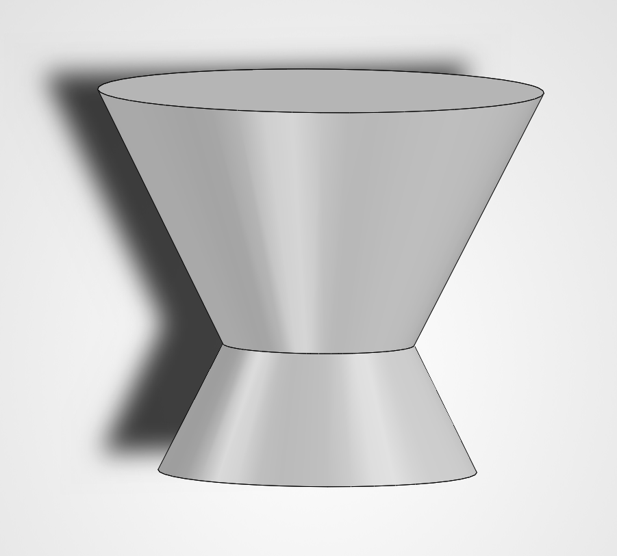
##### The Outer Shell
Next, for the outer shell, the bottom of the outer radius of the shell will be the same as the large cone of the top radius. However, the shell's inside will be the outline of the hourglass it is choking with with a gap that is actually the tolerance needed for this project that will be discussed later. This allows the pin to rotate. Lastly, I connected the outer radius to the top of the shell instead of completely copying the hourglass to make it easier to grip with the center of the linkage

 

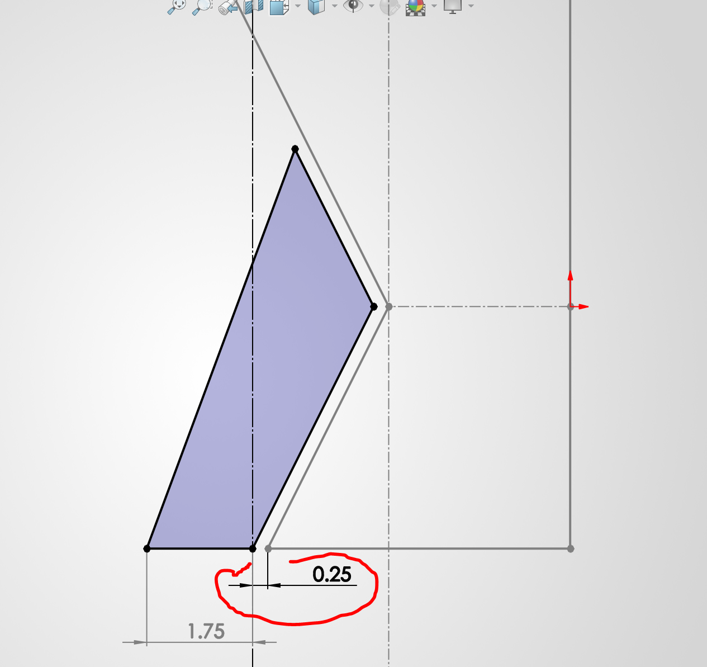

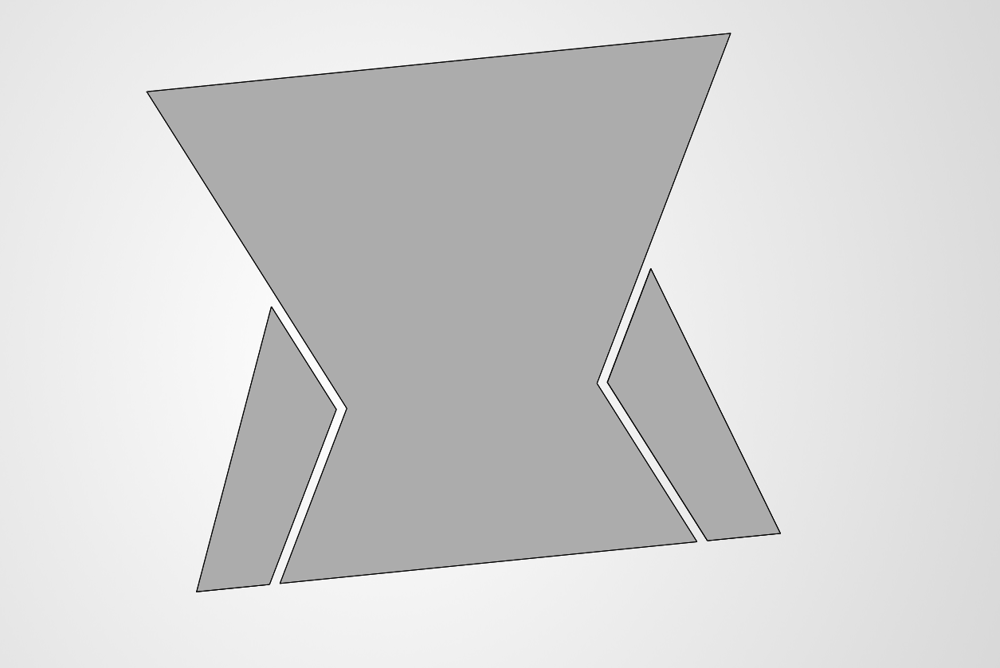

##### The Finished Pin
This gave me the result shown below:
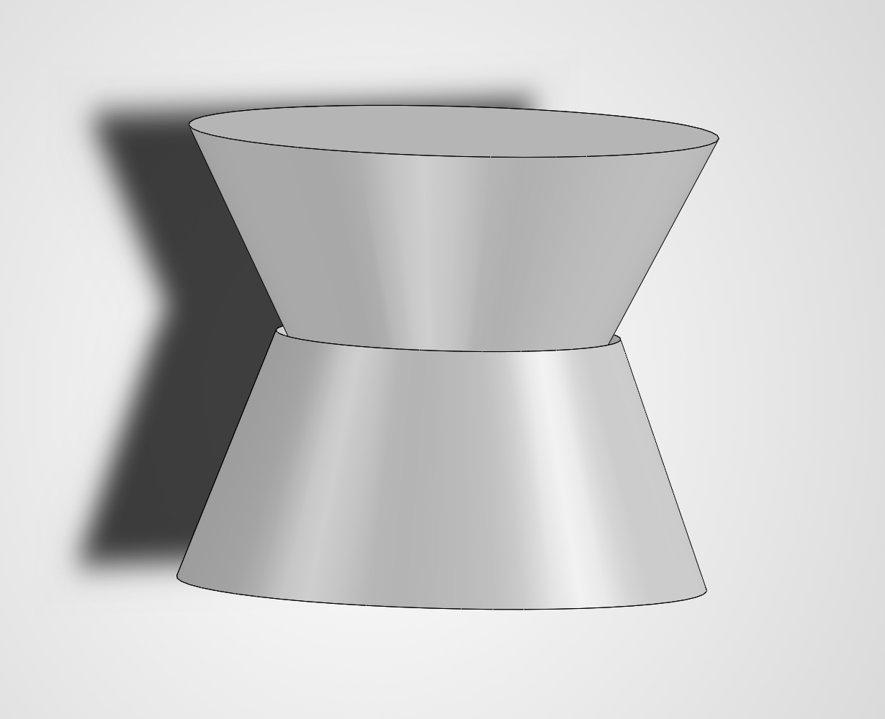
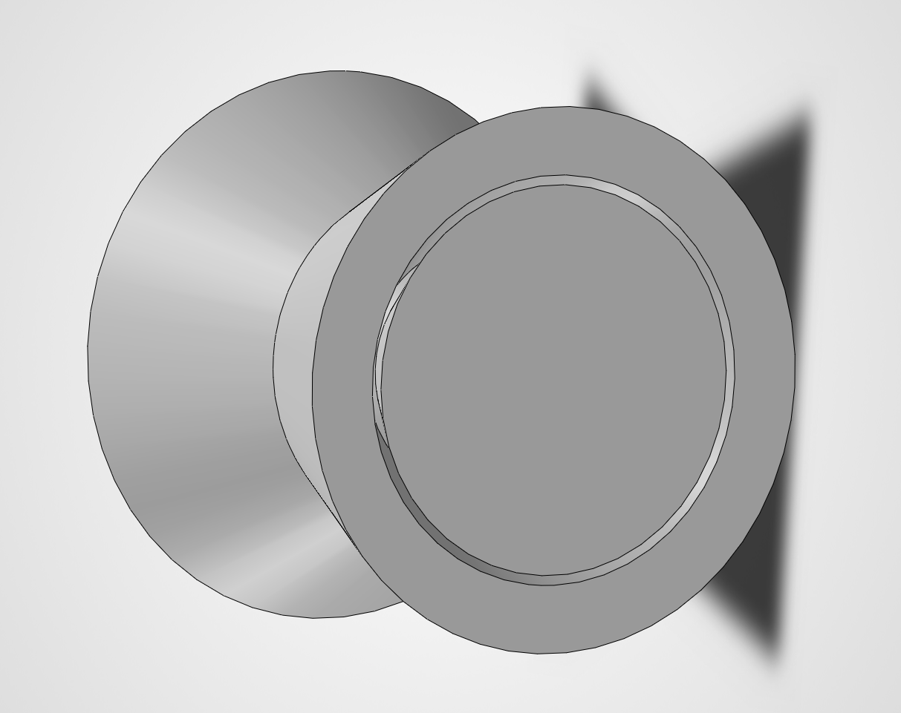

#### Finishing the Base Linkage
##### Creating the Lay Out of the Grabber
To create the distances from the pins, I side stepped making strange mirrors by making an ellipse outline starting from the center of the first pin. Since I decided that the center two pins have a 1 distance gap between their closet edges, I decide to make the edges between the long ways pins be five times that (I later made it slightly larger for better dimensions to connect the center of the links to the cone and shell). This created a 1/5 ratio, but I needed to make the eclipse based on the centers, so I just added the diameter of the larger cone with the 1 distance gap and multiplied it by 5. Then I used the circular pattern tool to put a pin at the the vertexes and co-vertexs of the ellipse.
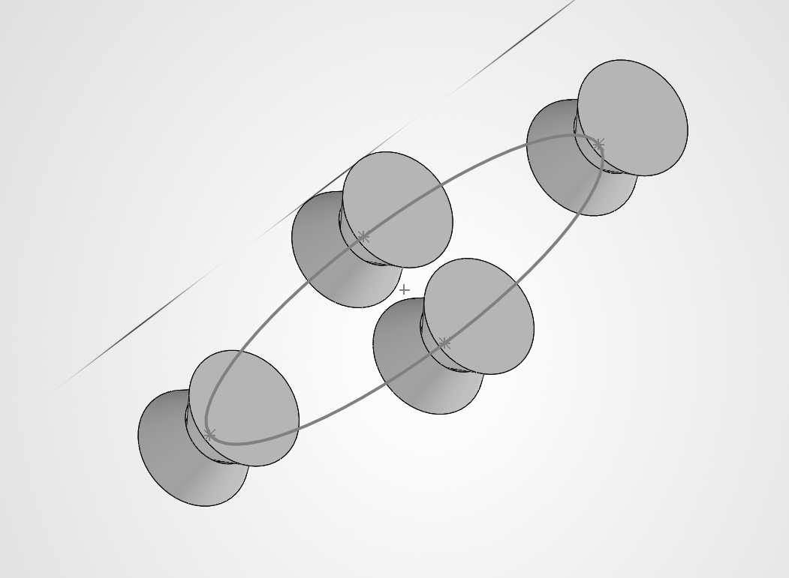
##### Center of the Linkage
Next I shaped the center of the link to connect one bottom outer shell on one side and one hourglass on the other. This is done by creating the center of the linkage at the same height of the hourglass, than connecting the linkage on one side to the top of the shell, and the other to top of the hourglass. However, the hourglass side has an additional top component to make sure everything connected together correctly and with additional support. Notice that there are angled gaps at the sides of the center linkage, this is to give a gap between the sections that should not connect but also to allow the further twisting at the pins for the claw and handle. The center starts from one edge of the hourglass, then is half a dimension away from the center axis, this was to make later patterning easier.

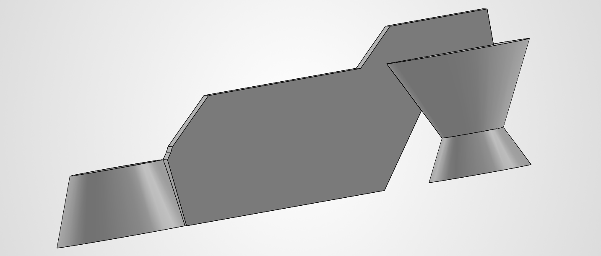

 

I realized that the connection of the center of the linkage and the outer shell was very thin due to how the sketch was made then extruded. To fix this, I created little steps in-between them to give more support so the model didn't print. This part was eyeballed, however, upon testing it ended up being perfect since it did not obstruct any movement.
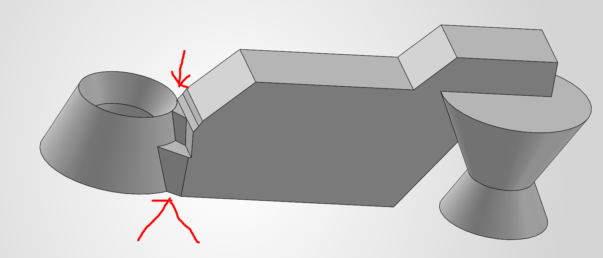

#### Connecting the Linkages at the Grabber's Center
##### Extending One Side
To create the first connection, I simply used a linear pattern of the first length with a gap of the length of it to create the second.

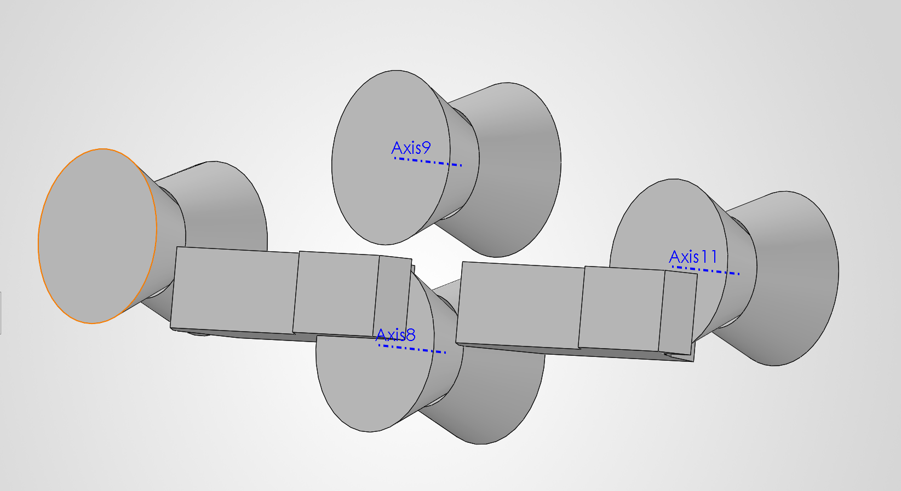

The only problem is that the stepped support I added at the connection of the outer shell did not flip, so I had to recreate it on the opposite side.

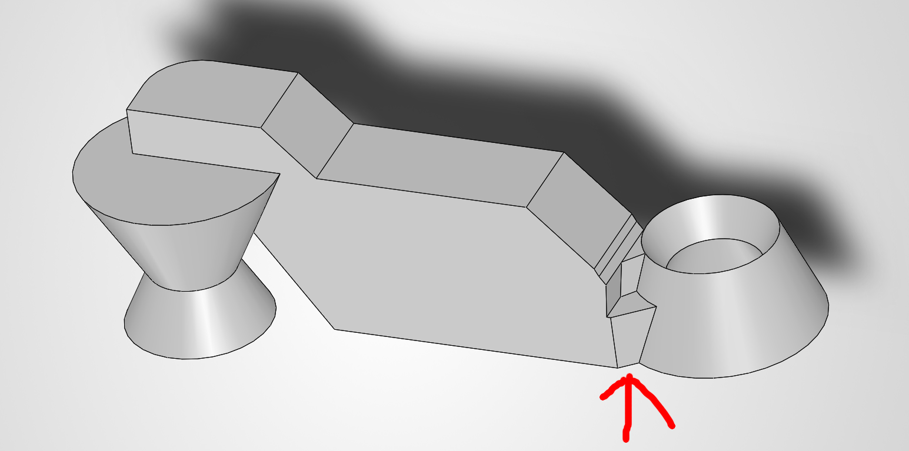

##### Rotation to Finish
Since on the other side of the long ways pins, the linkages needed to be mirrored AND reversed, I decide to just use a rotation pattern of the first two linkages along the center axis of the ellipse to simply achieve this. The reverse was needed in order to have a chain of the linkages that would allow movement.

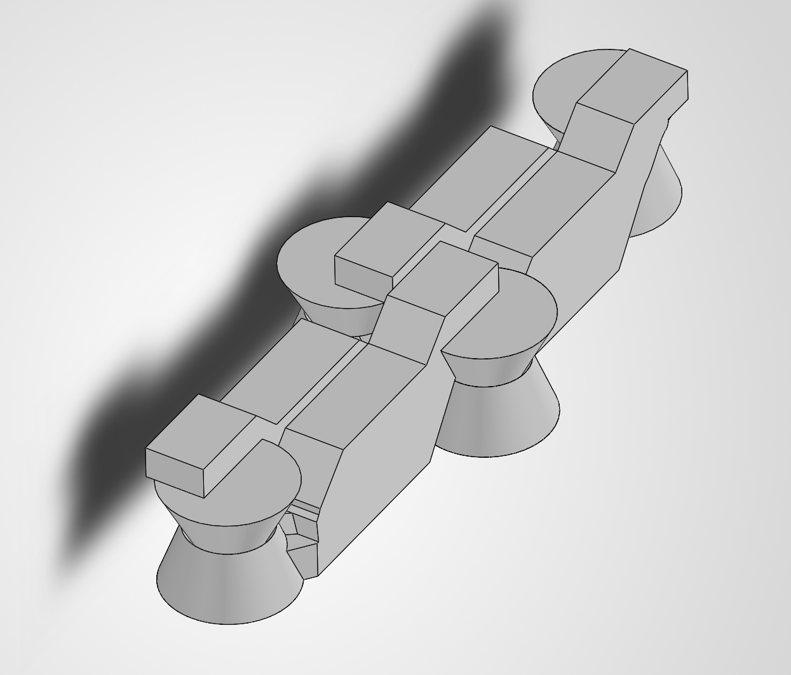

#### The Handle
In order to create the handle, I actually did the same exact rotation as the previous part. This time, I cut off the additional pin it created, and I split the linkage in half at both ends. Looking at other similar grabbers as mine, I realized that I should bend the handles to make it easier to extend the arm. So on one split linkage, at the halfway split point I created a handle that bent at a 60 degree angle, and made the length variable so that I could edit it if it doesn't work. My guess for the length actually worked out well. Then I simply mirror it to the other side. Due to this setup, it actually created one big linkage at both sides that will be show later.

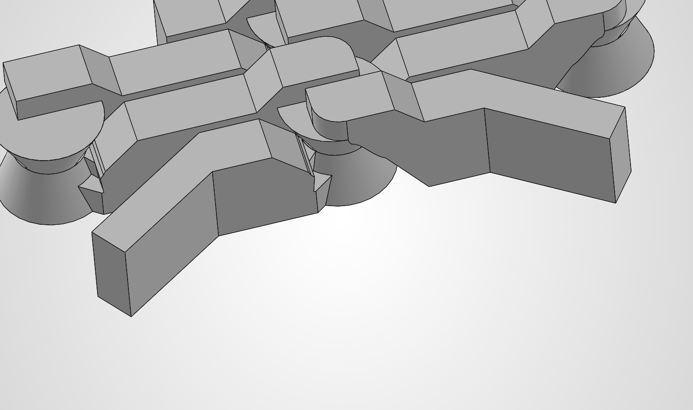
#### The Claw
To setup the claw, I actually did the same thing I had do with the handle but on the other side. However, this time I had to figure out the angles to allow the claw to clamp onto things. At this point, it was already too late to do a bunch of math and more testing to figure out the best angle. So I decided I had to break my rule and measure the original work that inspired me. To minimize any copying, I only took the angle of the insides of the claws tips to the center of the pin from their work. Then I figured everything out on my own based around that. By looking at other examples of the claw, I noticed there was a small gap between the tips of the claw to the pin, so I added that to the design. Once one side was finished, I simply mirrored it to the other linkage. 

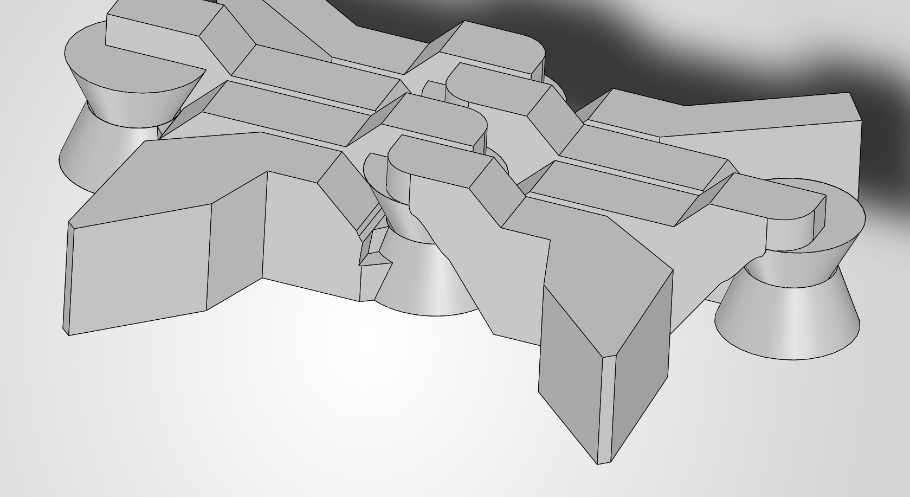

#### Final Adjustments
To finish the model, I then used the fillet tool to round the edges of the connection of the center linkage and the top of the hour class since part of the rectangular section was hanging off the edge. Then I rounded the claw itself to make it look nicer and look more like other grabbers I saw. With that, it is finished using ratio's that would allow easy scaling with the only adjustment being the distance of the tolerance and also allowing this to be printed in place.
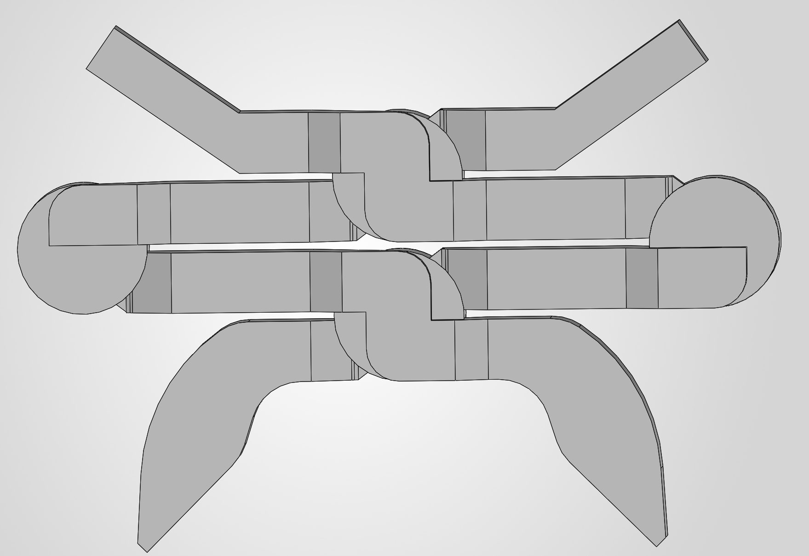

### Tolerances
Testing the tolerance gap was easy, I simply took the original hourglass pin I created and printed several versions of it with differing gaps. Now, keep in mind that due to being locked in place by the thin section of the cone, a tight fit was unnecessary and actually would create unneeded friction that would make it harder to use. For that reason, I was fine and actively looked for a clearance fit. The testing would require the gap between the radius of the 1/3 part of the hourglass and the outer shell's inner radius, not the diameter. The choice of radii has to be done this way for correct gaps, however, this meant the actual gap would be double since it will be on both ends of the circles. Testing from .1mm to .5mm gaps, I found that .2mm did clear, but it was unnecessarily tight, so I ended up deciding on .3mm.
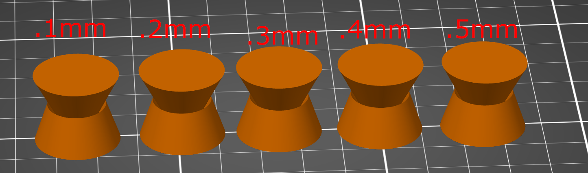

### Components 

| Component | Function | Print/Purchase |
| -------- | -------- | -------- |
| Handle Linkage Outer Shell   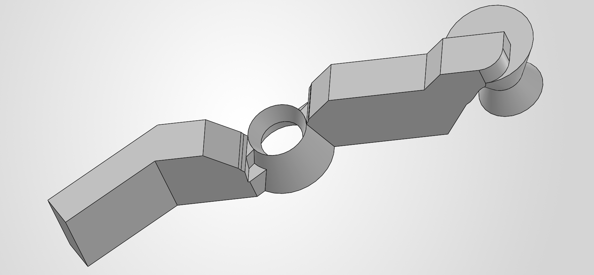 | This is the first "half" of the handle section to the x-cross section of the grabber. The handle linkage center joint rotates when the user applies a force at both handles, pushing them together. When the pair shell and hourglass are rotated, this makes the angles at the x-cross section increase (extending the arm) and the angle between the claws to decrease (closing the claw). This means that the handles bending inward are where the input angle for the function generation is at that controls the output angles for the claw linkages. This linkage in particular acts as the outer shell part of the joint that allows the handles to bend, while acting as the hourglass part of the end joint on one side of the x-cross section. The linkage creates path generation by moving its last outer joint to move forwards but to the right toward the center, though at a slight curvature. Also creating a straight path generation for the joint connecting the x section to the claws to move. Also allows the joint connecting the claw linkages to move forward and backward. Since this linkage moves other parts at an angle as well as changing their position, then this linkage in particular creates motion generation. | Printed |
| Handle Linkage Hourglass   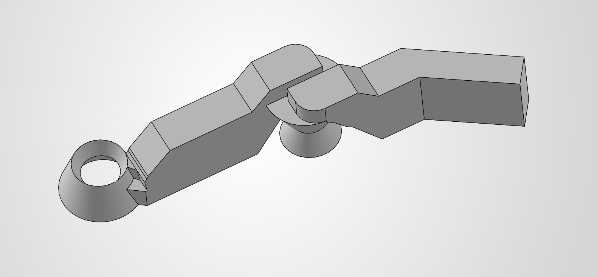 | This is the second "half" of the handle section to the x-cross section of the grabber. This works together with the first handle linkage to create the same path, function, and motion generation at certain parts of the grabber. It should be noted that the joint at which the handle linkages connect does not move and only rotates, meaning the handle overall doesn't create any generation at this joint. This linkage in particular acts as the hourglass part of the joint that allows the handles to bend, while acting as the outer shell part of the end joint on one side of the x-cross section. The linkage creates path generation by moving its last outer joint to move forwards but to the left toward the center, though at a slight curvature. | Print |
| Claw Linkage Outer Shell   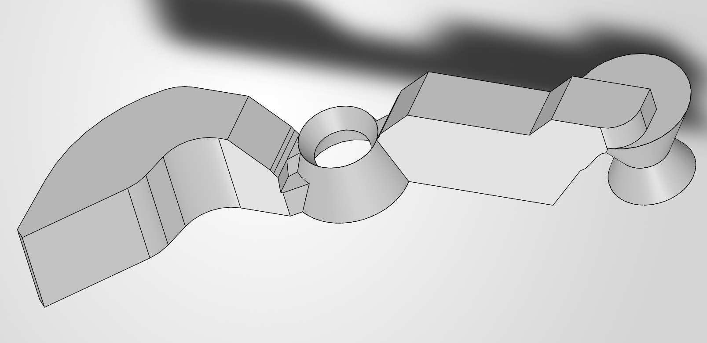 | This is the first "half" of the section that connects the x-cross section to the claw section. Since the angle between the claws is dependent on the input angle of the handle, this means that this linkage acts as the output angle for the function generation. Actually, this linkage is essentially the output of all generations created by the handle linkages. However, it should be noted that these linkages are not just reacting, they actively take part of  each generation caused by the handle linkages like how a string affects a puppet. If the size of the string changes, the puppet changes with it, and visa versa. Also, technically the rest of the system can be controlled by bending the claws instead of the handles, so it goes both ways. This specific linkage acts as the outer shell part of the joint that allows the claws to clamp. While it acts as the hourglass part of the joint that connects the claws to the x-cross section. | Printed |
| Claw Linkage Hourglass   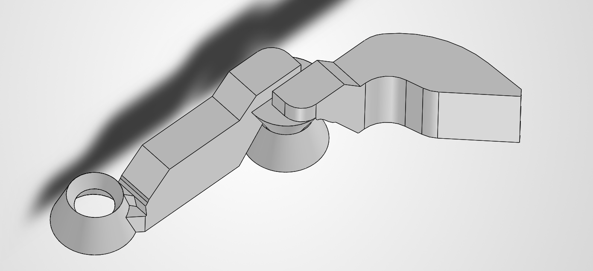 | This is the second "half" of the section that connects the the x-cross section to the claw section. Its description and function acts the same as the other Claw linkage. However, this specific linkage acts as the hourglass part of the joint that allows the claws to clamp. While it acts as the outer shell part of the joint that connects the claws to the x-cross section | Printed |

### The Whole Grabber
Although specific sections and joints might be the cause or effect of the different function, path, and motion generations. The whole actually only has path and function generation. The reason is that while certain sections experience angle changes as well as a combination of angle changes and position, the symmetry of the grabber along the center has the angles cancel each opposite angle out while only allowing a single forward moving path via elongation caused by the linkages. Meaning there is no motion generation, but there is path generation. But since the handles create an input angle that directly affects the claw angles, the claw angles act as an output angle. Meaning there is still function generation.

### Design Decisions
#### Hourglass Joints
The design decision that set the foundation on how the rest of the grabber worked was the choice of joints I used. For one, this made fits extremely easy because it allowed any reasonable clearance fit to work since the combination of the hourglass and outer shell were locked to each other due to the thin cross section of the hourglass. As long as the gap did not allow the two to detach (and was not insane), then free rotational movement can be achieved without everything falling apart. Furthermore, this allowed the entire grabber to be printed in place because this still kept ever hinge separate from each. Meaning no assembly was required. To compare in contrast to linkages that use cylindrical turning pairs (a transition fit between a hole in the link and a simple cylindrical joint) to allow rotational motion. Finding the right transition fit that would actually work with PLA, that took into account the general dimensional inaccuracies of FDMs, and as well as the weird issues of a specific printer that would cause further inaccuracies would take significantly more work that I do not have the time for. Furthermore, this type of fit connection would require printing links separately, since they can not be printed on top of each other without fusing together or needing to use strange support. Lastly, it would actually take further time to assembly the entire object together. 

#### Number of X-Cross Sections
Another design decision I made was to only use a two cross sections. Usually grabbers have several x-cross sections as seen in the image of the toy example I gave at the very start of this project. I had the ability to do this, however, I decided not to. For one, this could make issues allowing the grabber to fit on the bed depending on the final size of the grabber I wanted. Also, far more importantly, the more cross sections I added, the more PLA and print time would be required. As will be seen, my print time already took two and a half hours and was already fairly big. Adding more cross sections would be fun, but I simply did not have the time to print more. Also, it would take extra time to even add more to the model in the first place. Since only two were required to work, I decided to just keep things simple and stick with two.

#### Simple Claw and Handle
The claw and handles of a grabber can get very creative and intricate. As seen in the toy example I gave, a sort of gun mechanism could be used as a handle to extend and contract the grabber. However, that was way too complicated and would take far more time then I had. There are ways to make a basic but creative handle to use as a gripper as well. In the thingerverse model I found, the creator added actual scissor handles as the handle. In the end, I simply decided on extremely basic bent rectangular handles, because I simply did not have the time nor energy to get creative. I already wasted a ton of time trying to create cross sections that would work and as well as do different kinds of tests. I was limited on time, and I became frustrated with the creation of this thing. The same can be said with the claw, other versions had teeth on the claws or just mad the claw a strange pair of suction cup looking ends. I just decided to make an extreme basic no teeth claw to just move on with the project. The only extra work I did was add fillets to the claw which took a whole 5 minutes to do.

## 3D Print
Before I began, it should be noted that I pointed out to the professor last Tuesday that it seemed that their was an error in the documentation since it seemed this section had the exact same description as the last one. He agreed with me and told me he would fix it, however, he never did. For that Reason I will treat this section like previous labs did before. Describing settings and and how the 3D printing went.
### Slicer Settings

#### Build Orentation
The build orientation required to be on the only flat side left on the model in order for everything print in place and work. That is because this was side chosen as the base for the joints to print correctly and the links to connect each joint correctly.

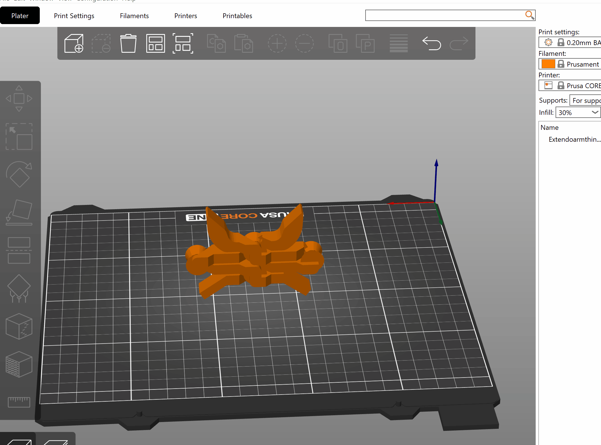

#### Infill and Infill Density
As I have learned before, mechanical parts should usually have a 50 percent infill density. However, this time I decided I had to used 30 percent. The sole reason was that 50 percentage infill increased the print time significantly. After some reading, I decided to use 30 percent instead because it can be an acceptable infill for mechanical parts that do not encounter significant stress or deflections while also dropping the print time to something more acceptable. Furthermore, I again decided on a gyroid infill because this would further complement the decrease in infill percentage by making up for lost strength due to giving more isotropic mechanical properties and its high strength to weight ratio.
#### Number of Walls. 
Three or more walls are generally recommended for mechanical parts since two or more walls allow adjacent hot extrusion lines to thoroughly overlap and fuse, reducing the risk of microscopic gaps or splitting under strain. Due to how thin the outer shell sections of the hourglass joint can get, I decided to chose four walls so that the entire outer shell could be 100% wall. This would allow better [dimensional accuracies at the thin top edges and not leave any potential gaps at the center of the walls](https://pmc.ncbi.nlm.nih.gov/articles/PMC9867140/) since there would be very little room for infills to be made.
#### Supports
Since all overhangs in this build did not go above 45 degrees, there was no reason to add support.

#### Scaling and Slicer Dimensions
Since this model was made with simple scaling in mind, I only had to take into account the gap dimension when scaling to a certain amount. To do so, I simply divided my desired gap distance by the scale of the print. For the file I used to print, I simply scaled the model to 1.5x since it gave a reasonable, usable print size while giving a reason print time. To fix the gap, I just plugged the gap dimension in solid works as .3/1.5. The end results gave me a 123mm by 84.85mm by 23.25mm print volume.

#### Seams
After reading about the different seams choices and how it relates to my print, I decided it would be best to just manually paint the seams. The reason is then I could actually see where the seams were and make sure none were in any holes since I was making a print in place model that other settings may cause issues. The gif below is only an example of painting that I made since the actual process took more time and thought. As seen in the image, the only sections that were curved that had seems were sections along the z-axis where there was a slightly non link connected space between the hourglass and outer shell parts of the joint.

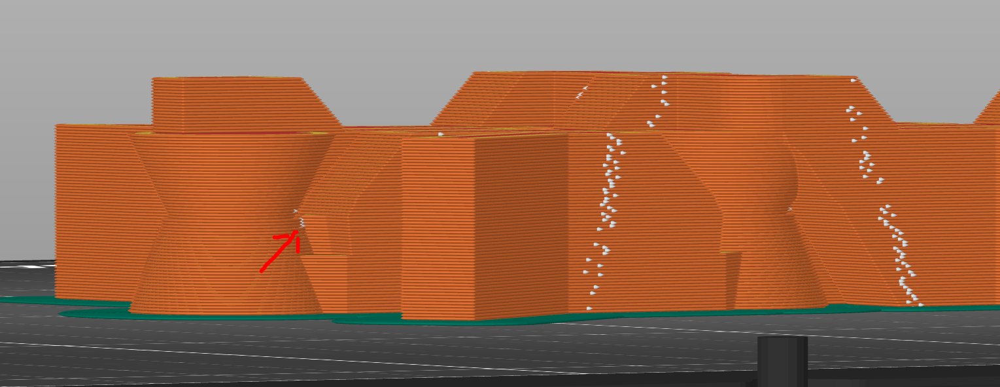

#### Elephant Foot Compensation
##### Testing
To test the elephant foot setting, I printed out four cubes with .2mm intervals of the elephant foot setting starting from 0. I chose .2mm intervals since those are the layer thicknesses I will print at. 
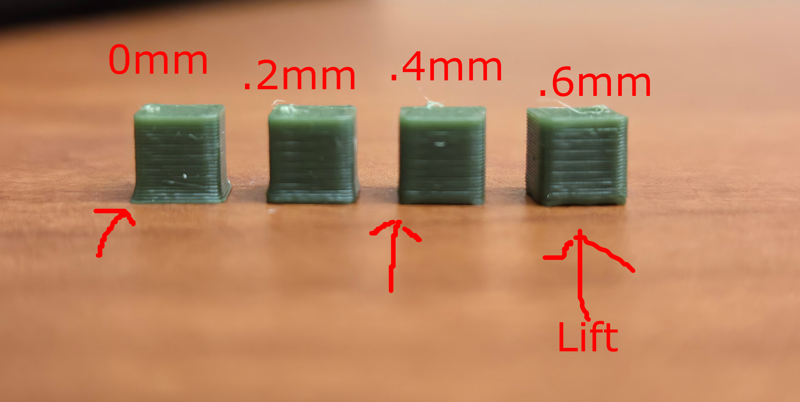

##### Setting Choice
Though it may be hard to see, .4mm setting was the best because it greatly reduced the elephant foot while also not raising any edges of the bend like the .6mm option did. Therefore, based on my testing, I set the compensastion to .4mm.

#### Brim
Making sure that the first layers would not lift off the bed after adding the elephant foot compensation, I decided to add a brim. The one problem I learned is that [the brim starts to not connect when adding the compensation](https://help.prusa3d.com/article/elephant-foot-compensation_114487). So it is likely a waste of time, but just in case I decided to add it to give as much support as possible.

#### Print Time
The end result was a print time of two and half hours.

### Printing Video
With the slicing finished, I took a usb and exported the gcode to it. Then I used the PC_03 printer to print my part. Below is a video of the process of the fit.

<iframe width="560" height="315" src="https://www.youtube.com/embed/RjB3uOHVoBA?si=vi3N-RhYKZXRP3VX" title="YouTube video player" frameborder="0" allow="accelerometer; autoplay; clipboard-write; encrypted-media; gyroscope; picture-in-picture; web-share" referrerpolicy="strict-origin-when-cross-origin" allowfullscreen></iframe>

### Finished Print
The final print finished without any issues and it works completely!
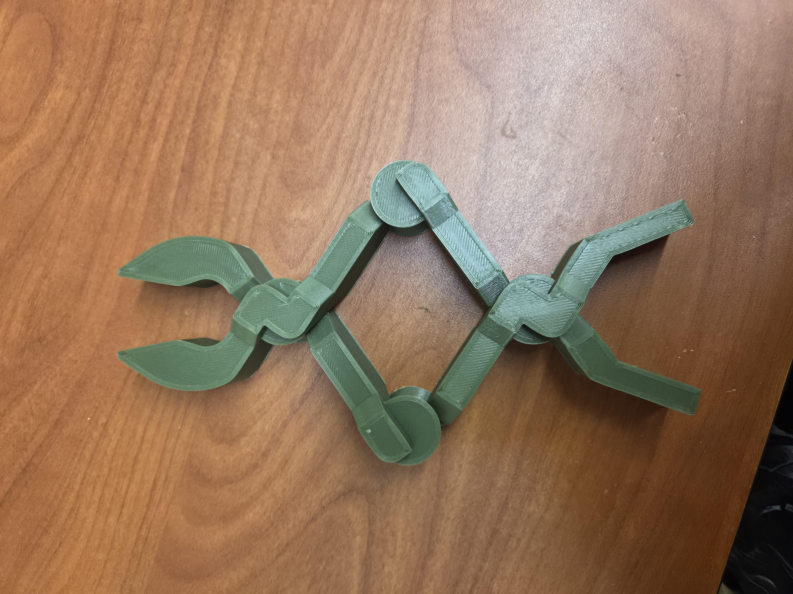

## Lessons Learned
### Time
Creating the model took the longest to create at about 10 hours because I had to make many adjustments to figure out how to create and make sure it works. Testing to find the right clearance gaps and elephant foot compensation took about one and half hours combined with most of it due to printing times. Figuring out the right slicer settings took about 45 minutes. The print time took about 2 and half hours for each print attempt (though I wrote at same time). There was no need for any post processing (other than taking 2 minutes to take the brim off) and since the part was designed to be print in place, I had no assembly time either. Lastly, the writing portion of this lab took about 8 hours (including while printing) to finish.

### Biggest mistake
The biggest mistake I made was that I did not realize that I had to adjust for the seam and elephant foot since it wasn't mentioned in the description or instructions and was only in the rubric. I did notice the one I printed had elephant foot sadly. Since they were discussed in class and since there was a slide dedicated to it, I decided to redo parts of my lab project. The problem with the elephant foot and possibly bad seams is that they can ruin certain fits since both could be found within gap between a "shaft" and hole. Causing a tighter fit that won't allow the fits to work. I quickly tested several small cubes with various elephant feet compensations and added the discovered setting, and then I brushed sections of the model in areas that would not cause contact issues, and  

### Tolerances
Another mistake I made was that I forgot compensate the change in the size of the gap when I scaled the print up. However, due to how my hourglass joint worked (as explained before) this was not a major issue and it worked perfectly fine. I was originally going to say that next time I would keep this in mind and fix it even though it didn't cause issues, however, I did have the opportunity to do it when I realized I was missing parts like the seams and elephant foot compensation. This time, I made sure to divide my desired gap by the scale I was using. The end result was a tighter fit with less movement along the center axis of the hourglass and with a little more give needing to be done in order to rotate the grabber.

## Part Download
[To download the part file, click here.](https://drive.google.com/file/d/1JkNz5_27-ZqNpxAdzjSXrANO3Cw-1M_m/view?usp=sharing)
## Resources 
### Websites
1. https://patents.google.com/patent/EP4511312A1/en
2. https://www.workplacepub.com/issues/2023/w0723.pdf
3. https://patents.google.com/patent/US20250223983A1/en
4. https://www.dumyah.com/en/toys-and-games/sports-and-outdoor-play/blasters-and-foam-play/jaru-robot-claw-grabber-toy-long-plastic-reacher-robot-hand-grab-tool-kids-interactive-learning-hand-eye-coordination-toy-assorted-color
5. https://www.thingiverse.com/thing:2750749
6. https://pmc.ncbi.nlm.nih.gov/articles/PMC9867140/
7. www.youtube.com
### Software
1. Solidworks
2. Gimp
3. Screen to GIF
### Physical
1. Prusa Core One+ printer labeled PC_03
2. PLA
